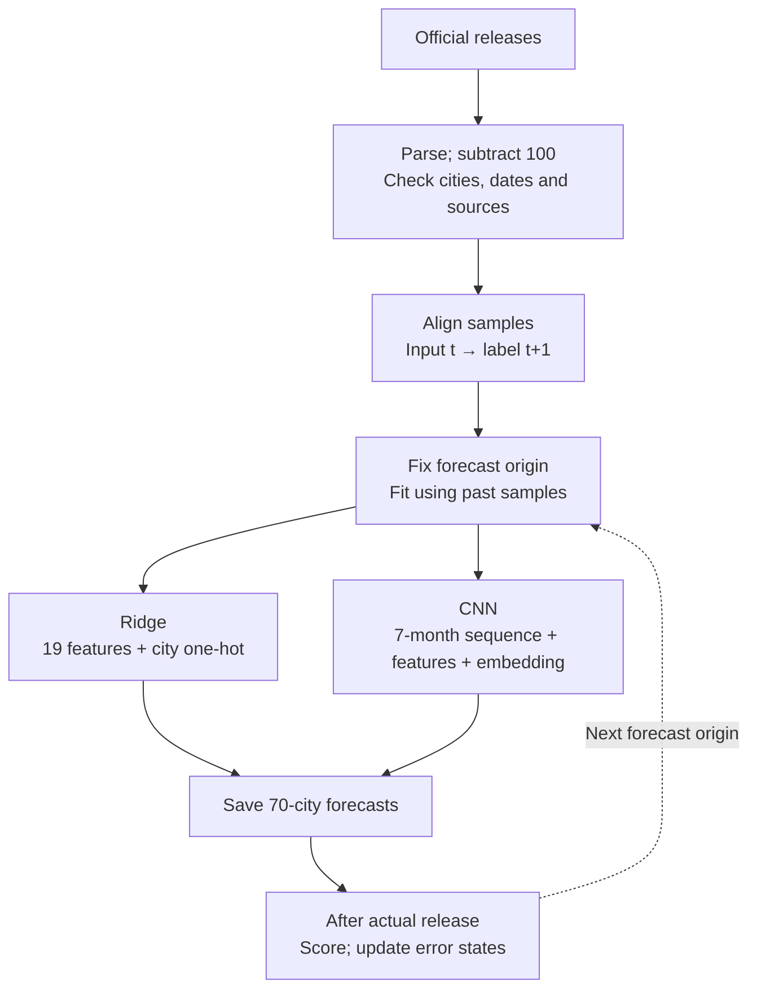

# Adaptive Forecasting of New-Home Price Movements Across 70 Chinese Cities

[中文](README.md) · [English](README.en.md) · [Methods](docs/methods.en.md) · [All results](docs/results.en.md) · [Dataset](docs/data.en.md) · [Figures](docs/figures/README.md)

Predict the next statistical month's new-home price-index movement in each city using official National Bureau of Statistics of China (NBS) releases. The project addresses regional market analysis for a property developer through data reconstruction, feature engineering, monthly model updates, neural design and temporal evaluation.

The input panel contains **57 months, 70 cities and 3,990 records, from May 2021 through January 2026**. The information cutoff is **28 February 2026**. The target is a city-level index movement: a reported index of 99.7 with previous month=100 means -0.3%. It is not an individual property valuation or a price per square metre.

## Results

MAE is the mean absolute difference between predicted and observed monthly movements, in **percentage points (pp)**; lower is better. The final neural candidate averages five fixed seeds.

| Method | 2024 rolling-validation MAE | Jan 2025-Jan 2026 retrospective MAE | Role |
| --- | ---: | ---: | --- |
| Last-month baseline | 0.3377 | 0.2487 | No-learning control |
| Monthly Ridge | 0.2781 | 0.2135 | Selected primary model |
| Seven-month contextual CNN | 0.2803 | 0.2067 | Five-seed neural candidate |
| Bias-corrected Ridge | 0.2760 | 0.2104 | Past-error calibration |
| Decomposed Ridge | 0.2913 | 0.2032 | Decomposed linear control |
| Online ensemble | 0.2769 | 0.2057 | Ensemble of selected experts |

The CNN's retrospective MAE is **16.9%** below last month and **3.2%** below monthly Ridge. Its five-seed validation MAE is 0.2803 versus Ridge's 0.2781. It does not pass the replacement gate, so Ridge remains the primary model. The CNN's paired MAE gain over Ridge has a descriptive 95% three-month block interval of **[-0.0049, 0.0206] pp**, crossing zero.


The researcher had already inspected this historical evaluation period before proposing the new methods; these comparisons are retrospective. Decomposed Ridge has a lower later-period score but is not retrospectively promoted. Values are traceable to the [machine-readable outputs](research/results/research/).

## Data and forecast timing

The panel is reconstructed from [NBS monthly housing-price releases](https://www.stats.gov.cn/sj/zxfb/202602/t20260213_1962617.html). Every city-month retains its official URL. There are no missing values or duplicate city-months.

| Field | Definition |
| --- | --- |
| `period`, `city` | Statistical month and city |
| `new_mom_pct` | New-home index MoM movement: reported index minus 100 |
| `second_mom_pct` | Second-hand index MoM movement: reported index minus 100 |
| `source_url` | Official release page for that statistical month |


Forecasts are issued after the previous statistical month's release, generally after the target month has started. January 2026 indices were released on **13 February 2026**; February's full-month outcome is forecast after that date. January data are not assumed available on 1 February. February 2026 actuals are excluded from fitting, selection and scoring.

## From data to prediction



Each supervised sample is one city and one target month. Inputs end at released month t; the label is the new-home movement in t+1. The sequence spans t−6…t. May–November 2021 is the first window, paired with December 2021. There are 50 known target months and one unlabeled February 2026 output.

| Numeric feature group | Count | Construction |
| --- | ---: | --- |
| Current city values | 2 | Both channels in t |
| Market context | 3 | Equal-weight panel means of both channels; new-home rising share |
| Calendar | 2 | Sine/cosine of the input month |
| City lags | 8 | Both channels at t−1, t−2, t−3 and t−6 |
| City rolling means | 4 | Both channels over 3 and 6 months, including t |

Ridge and CNN share these 19 explicit features; the CNN additionally reads the full seven-month sequence. Column names, scaling and aligned examples are in [Methods](docs/methods.en.md).

## Temporal protocol

| Stage | Target months | Initial training-label cutoff | Origins / city rows |
| --- | --- | --- | ---: |
| Rolling validation and selection | Jan-Dec 2024 | Dec 2023; 25 months / 1,750 rows | 12 / 840 |
| Retrospective rolling evaluation | Jan 2025-Jan 2026 | Dec 2024; 37 months / 2,590 rows | 13 / 910 |
| As-of output | Feb 2026 | Jan 2026; 50 months / 3,500 rows | 1 / 70 |

At each origin, models, scalers, class weights and error states use released past information only. All cities advance together. Realized labels may affect the next origin after release. Additional quarterly checks select next-quarter configurations and experts using earlier quarters only.

Models are **refitted monthly on an expanding window**. For January 2025, training labels run from December 2021 through December 2024 (37 months); forecast inputs cover June–December 2024. For February 2025, the released January label expands training to 38 months. Scalers fit training samples only. Neural models restart from fixed seeds at each origin; bias correction and online averaging separately carry past-error states. Early months remain in training; rolling evaluation measures adaptation to market changes.


## Model design

### Primary: monthly Ridge

Ridge receives 19 standardized numeric features and a 70-dimensional city one-hot code, totaling 89 columns. It fits L2-regularized linear regression with an intercept; the selected penalty is alpha=25. Numeric coefficients are shared across cities, with city-specific intercept offsets. Ridge directly predicts the next movement. Last month simply outputs the city's known movement in t.

### Neural candidate: seven-month contextual CNN

Convolutions extract local temporal patterns; city embeddings represent city differences; explicit features provide lag, market and calendar context. The head learns a correction to the last known movement. Its zero-initialized output layer starts training at the last-month baseline.


| Stage | Operation | Tensor shape |
| --- | --- | --- |
| Sequence input | Two channels; scale with past training-window statistics | B×70×7×2 → (B×70)×2×7 |
| Temporal encoding | Conv1d 2→12→12; kernel=3, padding=1; ReLU after each | (B×70)×12×7 |
| Temporal pooling | Mean over seven positions | B×70×12 |
| Concatenation | 12 sequence + 19 numeric + 4 embedding dimensions | B×70×35 |
| Correction head | Linear35→24, ReLU, Dropout0.15, Linear24→1 | B×70×1 |
| Output | Last known new-home movement + correction δ | B×70 |

B counts target months: all historical label months during fitting and B=1 for single-month inference. Cities share the convolution/head weights; panel statistics supply cross-city context. The current CNN has no city-graph message passing. Parameters are embedding 280, convolutions 84+444 and head 864+25, totaling **1,697**. Its implementation ID is `fair_tcn`.

### Training and inference

| Item | Implemented setting |
| --- | --- |
| Neural fit | Full batch of past months and 70 cities; 60 fixed epochs |
| Optimizer | AdamW; learning rate 0.006, weight decay 0.02, gradient clipping 1 |
| Core regression loss | Smooth L1 (Huber form), beta=0.25, averaged over months × cities |
| Seeds | Screen 13/31/47; final CNN and weighted direction candidate use 13/31/47/61/79 |
| Inference | Disable Dropout; average seed predictions |

Recorded example for Jinan in February 2026: the known January movement is −0.4%; Ridge predicts −0.2155% and CNN −0.3255%, implying a CNN correction of approximately +0.0745 pp. No actual February label is attached. Values come from the [final forecast CSV](research/results/research/forecast_2026_02.csv).

## Configuration comparisons and selection

| Experiment group | Implementation | Single-model configurations |
| --- | --- | ---: |
| Baselines and input controls | Three Ridge penalties, two tree sizes, NLinear-style model, six-month prototype and seven-month CNN | 8 |
| Reversible window normalization | Known-window statistics; restore the target-channel scale | 1 |
| Past-error calibration | EWMA of Ridge out-of-sample signed errors; two decay factors × two correction strengths | 4 |
| Market/city decomposition | Equal-weight 70-city mean plus centered city residual; linear and neural controls | 3 |
| Auxiliary direction learning | Rise/flat/fall cross-entropy; two loss weights × class weighting on/off | 4 |

These are separately compared configurations. The final CNN uses the base contextual architecture; normalization, decomposition and the direction head are tested in separate variants. Additional losses, bias formulas and online weights are documented under [Separate ablations](docs/methods.en.md#separate-ablations).

All 20 single models receive 2024 validation. Selected neural/direction candidates receive five-seed confirmation; the primary and eight representatives are recorded before later-period scoring. Both ensembles use Ridge, CNN and last month. Full-year ensemble validation includes full-year expert-selection uncertainty; additional checks select experts from past quarters only.


The primary-model gate requires at least 3% lower 2024 MAE, improvement in at least eight months, and no half-year deterioration above 5%. No additional single model passes. The best bias correction lowers validation MAE by 0.75%. Normalization, decomposition and multitask outcomes, including non-improvements and individual seed scores, are retained.

## Shandong cases and direction diagnostics


The retrospective panel contains 705 falling, 160 rising and 45 flat records. Rising-case MAE is 0.2888 for last month, 0.3491 for Ridge and 0.3247 for the CNN. The CNN improves on Ridge but remains behind last month on rising cases. Learned models also underperform last month in Jining.

[Direction confusion and period comparisons](docs/figures/en/06_direction.png) · [Quarterly and rebased-month sensitivity](docs/figures/en/08_robustness.png) · [All city and segment results](docs/results.en.md)

## Reproduction

Use Python 3.11 in an isolated environment; see the [runbook](docs/reproducibility.md). Cleaned data and final checkpoints are included. Saved-model inference requires neither redownloading data nor retraining.

```bash
git clone https://github.com/LRZer/Real-estate.git
cd Real-estate
python -m pip install -r requirements.txt
python -m pip install torch==2.5.1 --index-url https://download.pytorch.org/whl/cpu
python research/predict_saved_models.py
python scripts/verify_repository.py
```

```bash
# Full experiments; February 2026 actuals remain excluded
python research/run_research_experiments.py
python research/analyze_research_results.py
python research/verify_research_protocol.py
# Rebuild repository figures from recorded outputs
python scripts/build_figures.py --language both
```

Checks cover dataset/checkpoint SHA256, reported MAE against saved predictions, 315 training-cutoff records and checkpoint inference. Eight model types passed future-data perturbation checks. Saved-model reproduction differs by less than 2e-7 pp. GitHub Actions runs data, metric, documentation-link and checkpoint checks.

## Repository map

| Path | Contents |
| --- | --- |
| [research/data/official_nbs_70city.csv](research/data/official_nbs_70city.csv) | 3,990 cleaned records |
| [research/source_index.csv](research/source_index.csv) | 57 original releases; [release calendar](research/results/research/release_calendar.csv) |
| [research/train_forecast.py](research/train_forecast.py) | `build_dataset()` constructs 19 features, next-month labels and source alignment |
| [research/research_models.py](research/research_models.py) | Neural, Ridge, tree and decomposition implementations |
| [research/run_research_experiments.py](research/run_research_experiments.py) | Locked configurations, rolling fits, selection and ensembles |
| [research/results/research/](research/results/research/) | Configurations, predictions, metrics, seeds and audits; `models/` contains final checkpoints |
| [research/predict_saved_models.py](research/predict_saved_models.py) | Load saved scaling and weights to reproduce 70-city forecasts |
| [docs/](docs/) | Bilingual methods, dataset cards, results and PNG/SVG figures |
| [Complete Chinese report](research/最终实验报告.md) | [Eight-page Chinese PDF](research/output/pdf/70城新房指数预测_成果展示.pdf) |

`research/` preserves the completed snapshot and earlier frozen, graph-temporal and adaptive studies. Current conclusions are stated here and in `results/research/`. Environments, downloaded HTML pages and fit caches are excluded.

## References and scope

References include [RevIN, ICLR 2022](https://github.com/ts-kim/RevIN), [NLinear, AAAI 2023](https://github.com/cure-lab/LTSF-Linear) and [OneNet, NeurIPS 2023](https://proceedings.neurips.cc/paper_files/paper/2023/hash/dd6a47bc0aad6f34aa5e77706d90cdc4-Abstract-Conference.html). These are independent adaptations to this panel, not full replications of the papers or their benchmark scores.

The completed version was developed in September-October 2026, reconstructing the information set of 28 February 2026. Official pages were retrieved later; the absence of revisions cannot be established. January 2026 base/category-weight changes are reported separately. Training and evaluation use the same 70 cities; temporal generalization is evaluated, while unseen-city generalization is not. No company transaction, marketing or client data were used, so property-level valuation, sales uplift and deployment effects were not evaluated.
