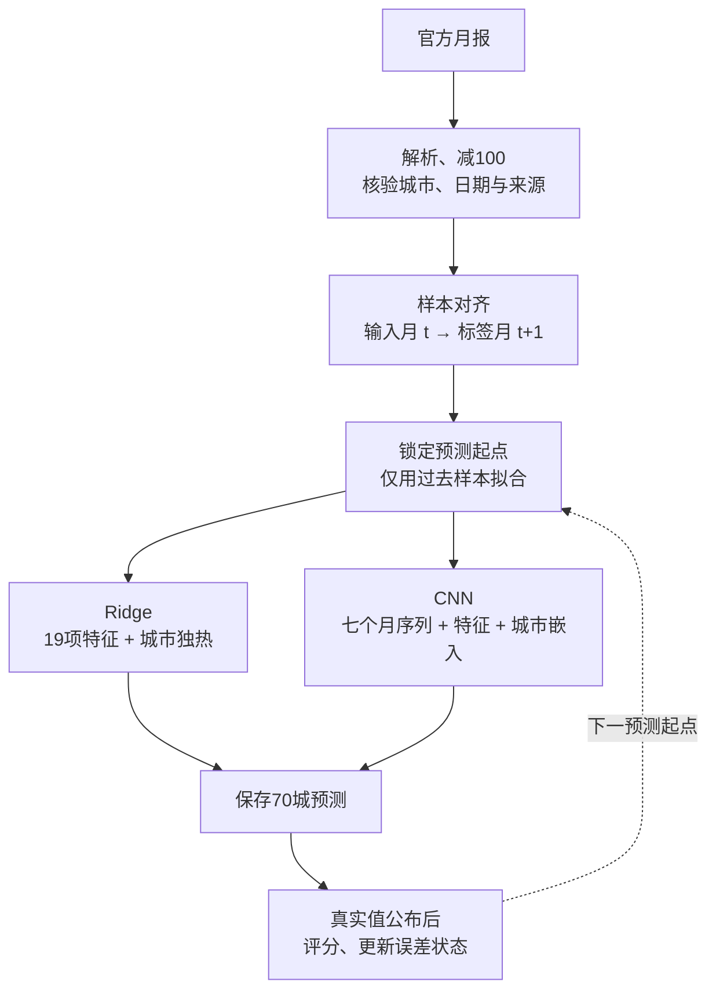

# 中国70城新房价格指数自适应预测

[中文](README.md) · [English](README.en.md) · [技术说明](docs/methods.zh.md) · [完整结果](docs/results.zh.md) · [数据说明](docs/data.zh.md) · [图表索引](docs/figures/README.md)

使用国家统计局70城月报，预测各城市下一统计月的新建商品住宅价格指数环比变化。项目围绕房地产开发商的区域市场研判场景，完成官方数据整理、特征构建、逐月重训、神经网络设计和时间序列评估。

数据覆盖 **2021-05至2026-01，57个月、70城、3990条记录**；信息截点为 **2026-02-28**。预测量是城市指数变化，例如“上月=100”的指数99.7对应-0.3%，不输出单套住宅价格或元/平方米。

## 结果

MAE是预测变化与真实变化的平均绝对差，单位为**百分点**，越低越好。最终神经候选使用五个固定种子的平均预测。

| 方法 | 2024滚动验证MAE | 2025-01至2026-01回顾性MAE | 角色 |
| --- | ---: | ---: | --- |
| 沿用上月 | 0.3377 | 0.2487 | 无学习基线 |
| 逐月Ridge | 0.2781 | 0.2135 | 验证支持的主模型 |
| 七个月上下文网络 | 0.2803 | 0.2067 | 五种子神经候选 |
| 近期偏差校正Ridge | 0.2760 | 0.2104 | 过去误差校正 |
| 双分支Ridge | 0.2913 | 0.2032 | 分解线性对照 |
| 在线组合 | 0.2769 | 0.2057 | 已选择专家的组合 |

上下文网络的回顾性MAE较沿用上月降低 **16.9%**，较逐月Ridge降低 **3.2%**。网络五种子验证MAE为0.2803，Ridge为0.2781，未通过替换门槛，主模型保留Ridge。网络相对Ridge的MAE收益95%三个月区块区间为 **[-0.0049, 0.0206]**，跨过0。


新增方法提出前，该历史评估区间已被研究者查看，因此以上属于回顾性研究。双分支Ridge后期得分更低，但未据其后期成绩重新选模。数值对应[机器可读结果](research/results/research/)。

## 数据与预测时点

数据来自[国家统计局70城住宅销售价格月报](https://www.stats.gov.cn/sj/zxfb/202602/t20260213_1962617.html)。每条记录保留官方来源；无缺失值和重复城市月份。

| 字段 | 含义 |
| --- | --- |
| `period`、`city` | 统计月份与城市 |
| `new_mom_pct` | 新建商品住宅指数环比，原指数减100 |
| `second_mom_pct` | 二手住宅指数环比，原指数减100 |
| `source_url` | 该月份官方原始页面 |


预测在上一统计月月报公布后执行，通常已进入目标月中旬。例如1月指数于2026-02-13公布，此后预测2月整月结果；不能在2月1日使用尚未公布的1月数据。2026年2月实际值未进入训练、选模或评分。

## 从数据到预测



每个监督样本对应一个城市和一个目标月：以已公布月 t 及之前数据构建输入，标签是 t+1 月新房环比。七个月窗口为 t−6…t；首个窗口2021-05…11对应2021-12标签，得到50个已知标签月和一个2026-02无标签预测月。

| 数值特征组 | 数量 | 计算方式 |
| --- | ---: | --- |
| 本城当前值 | 2 | t月新房、二手房环比 |
| 同期市场背景 | 3 | 70城两通道等权均值、新房上涨城市比例 |
| 月份周期 | 2 | 输入月份sin/cos编码 |
| 本城滞后值 | 8 | 两通道各取t−1、t−2、t−3、t−6 |
| 本城滚动均值 | 4 | 两通道各取包含t的3月、6月均值 |

Ridge和CNN共享这19项显式特征；CNN另读取七个月完整序列。特征列名、标准化与样本示例见[技术说明](docs/methods.zh.md)。

## 时间划分与更新

| 阶段 | 预测目标月 | 首个起点的训练标签截止 | 起点数/城市行 |
| --- | --- | --- | ---: |
| 滚动验证与选配置 | 2024-01至2024-12 | 2023-12，25个月/1750行 | 12 / 840 |
| 回顾性滚动评估 | 2025-01至2026-01 | 2024-12，37个月/2590行 | 13 / 910 |
| 截点输出 | 2026-02 | 2026-01，50个月/3500行 | 1 / 70 |

每个起点的模型、标准化、类别权重和误差状态只使用已公布的过去数据；70城一起推进，不混合未来月份。收到新月真实值后，才能更新下一起点。另做只根据此前季度选下季度配置和专家的检查。

采用**扩展窗口、每月重新训练**。例如预测2025-01时，训练标签为2021-12…2024-12（37个月），预测输入窗口为2024-06…12；预测2025-02时，2025-01标签已公布，训练增加到38个月。标准化只拟合训练样本。神经网络每次从固定种子重新初始化；偏差校正和在线组合另维护过去误差状态。扩展窗口保留早期月份，市场变化能否被吸收由滚动评估检验。


## 模型设计

### 主模型：逐月 Ridge

输入为19项标准化数值特征及70维城市独热编码，共89列；使用带截距的L2正则线性回归，最终alpha=25。所有城市共享数值特征系数，城市编码提供不同截距。Ridge直接预测下一月环比；沿用上月基线直接输出本城已知t月环比。

### 神经候选：七个月上下文 CNN

卷积提取窗口内局部时间模式，城市嵌入表示城市差异，19项显式特征提供滞后、市场与周期背景。预测头学习对已知上期环比的修正，输出层零初始化，因此训练开始时等价于沿用上月。


| 阶段 | 实现 | 张量变化 |
| --- | --- | --- |
| 序列输入 | 两通道；按过去训练窗口统计量标准化 | B×70×7×2 → (B×70)×2×7 |
| 时间编码 | Conv1d 2→12→12；kernel=3、padding=1；各层ReLU | (B×70)×12×7 |
| 时间池化 | 对7个时间位置取均值 | B×70×12 |
| 特征拼接 | 12维序列表示 + 19项特征 + 4维城市嵌入 | B×70×35 |
| 修正头 | Linear35→24、ReLU、Dropout0.15、Linear24→1 | B×70×1 |
| 输出 | 已知t月新房环比 + 修正量δ | B×70 |

B是本次使用的目标月份数：训练B=历史标签月数，单月推理B=1。70城共享卷积和预测头；城市间背景由面板统计特征提供。当前CNN的时间卷积没有城市图消息传递。参数为嵌入280、卷积84+444、预测头864+25，共**1697**；实现ID为`fair_tcn`。

### 训练与推理设置

| 项目 | 已实现设置 |
| --- | --- |
| 每次神经拟合 | 全部过去训练月及70城一起计算梯度，固定60轮 |
| 优化 | AdamW，学习率0.006，权重衰减0.02，梯度裁剪1 |
| 主回归损失 | Smooth L1（Huber形式），beta=0.25；对月×城取均值 |
| 随机种子 | 原始筛选13/31/47；CNN与加权方向代表最终用13/31/47/61/79 |
| 推理 | 关闭Dropout，平均各个种子的环比预测 |

以已保存的2026-02济南预测为例：已知2026-01新房环比−0.4%，Ridge预测−0.2155%，CNN预测−0.3255%，后者学习的修正量约+0.0745 pp。该月未附实际标签；数值来自[最终预测CSV](research/results/research/forecast_2026_02.csv)。

## 配置对照与模型选择

| 工作组 | 实现 | 单模型配置数 |
| --- | --- | ---: |
| 基线与输入对照 | Ridge三个alpha、两种叶节点树、NLinear形式、六个月原型、七个月上下文网络 | 8 |
| 可逆窗口归一化 | 已知窗口均值方差；按新房通道恢复输出尺度 | 1 |
| 过去误差校正 | Ridge样本外有符号误差EWMA，两个衰减系数×两个修正强度 | 4 |
| 市场与城市分解 | 70城等权均值+零均值城市残差，线性及神经对照 | 3 |
| 方向辅助任务 | 涨/平/跌交叉熵，两种损失权重×是否类别加权 | 4 |

这些是分别比较的配置；最终CNN对应基础上下文架构。归一化、双分支和方向头在独立配置中检验。额外损失、误差校正公式及在线权重更新详见[独立结构消融](docs/methods.zh.md#独立结构消融)。

20个单模型先完成2024验证；依据验证结果选出神经与方向候选并做五种子确认，保存主模型和8个代表单模型的选择记录，再进行后期评估。两个组合使用Ridge、CNN及沿用上月三位专家；组合的全年验证成绩含全年专家选择的不确定性，另提供只用过去季度选择的检查。


主预测替换门槛：2024 MAE下降至少3%、至少8个月改善、任一半年恶化不超过5%。所有新增单模型均未通过；最佳偏差校正验证改善0.75%。归一化、双分支和方向任务的负结果与各个种子得分均保留。

## 山东案例与方向诊断


回顾性记录中705条下跌、160条上涨、45条持平。上涨MAE：沿用上月0.2888、Ridge0.3491、上下文网络0.3247。网络改善Ridge，但上涨仍不及无学习基线；济宁学习模型也未超过沿用上月。

[方向混淆矩阵及跨阶段指标](docs/figures/zh/06_direction.png) · [季度、2025全年和基期调整月份敏感性](docs/figures/zh/08_robustness.png) · [完整城市与分段结果](docs/results.zh.md)

## 复现

使用Python 3.11，先创建并激活独立环境，见[运行手册](docs/reproducibility.md)。清洗数据和最终权重已包含，无需重新采集或重训即可复现截点预测。

```bash
git clone https://github.com/LRZer/Real-estate.git
cd Real-estate
python -m pip install -r requirements.txt
python -m pip install torch==2.5.1 --index-url https://download.pytorch.org/whl/cpu
python research/predict_saved_models.py
python scripts/verify_repository.py
```

```bash
# 完整实验；不使用2026年2月实际值
python research/run_research_experiments.py
python research/analyze_research_results.py
python research/verify_research_protocol.py
# 从已保存结果重建仓库图表
python scripts/build_figures.py --language both
```

核验包括数据与模型SHA256、报告MAE与逐条预测一致、315条训练截止记录及保存权重推理。八类代表模型已通过未来数据扰动检查；保存权重复现差异小于2×10^-7个百分点。GitHub Actions自动执行数据、指标、文档链接和权重推理核验。

## 文件导航

| 路径 | 内容 |
| --- | --- |
| [research/data/official_nbs_70city.csv](research/data/official_nbs_70city.csv) | 3990条清洗记录 |
| [research/source_index.csv](research/source_index.csv) | 57期原始来源；[发布日期表](research/results/research/release_calendar.csv) |
| [research/train_forecast.py](research/train_forecast.py) | `build_dataset()`构建19项特征、下一月标签及来源对应 |
| [research/research_models.py](research/research_models.py) | 网络、Ridge、树和双分支实现 |
| [research/run_research_experiments.py](research/run_research_experiments.py) | 锁定配置、逐月验证、选模与组合 |
| [research/results/research/](research/results/research/) | 配置、预测、指标、种子和截止审计；`models/`为最终权重 |
| [research/predict_saved_models.py](research/predict_saved_models.py) | 加载已保存标准化参数与权重，直接复现70城预测 |
| [docs/](docs/) | 中英文方法、数据说明、详细结果及PNG/SVG图表 |
| [完整中文实验报告](research/最终实验报告.md) | [八页展示PDF](research/output/pdf/70城新房指数预测_成果展示.pdf) |

`research/`保留原始完成版及早期冻结、图时序、自适应实验，便于追溯；当前结论以本页及`results/research/`为准。训练环境、网页和拟合缓存不入库。

## 方法参考与范围

参考[RevIN，ICLR2022](https://github.com/ts-kim/RevIN)、[NLinear，AAAI2023](https://github.com/cure-lab/LTSF-Linear)和[OneNet，NeurIPS2023](https://proceedings.neurips.cc/paper_files/paper/2023/hash/dd6a47bc0aad6f34aa5e77706d90cdc4-Abstract-Conference.html)，采用本面板的独立适配，不复现论文完整架构或原数据集成绩。

完成版开发于2026年9月至10月，模拟2026-02-28信息集；官方页面于9月重采，无法证明其从未修订。2026年1月基期与分类权重调整已单独报告。训练和评估覆盖同一70城，检验的是未来月份，未验证未见城市的泛化。没有公司成交、营销或客户数据，因此未评估楼盘定价、销量提升或部署效果。
