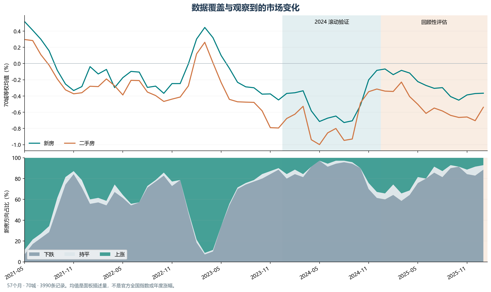

# 数据说明

[English](data.en.md) · [方法](methods.zh.md) · [结果](results.zh.md)

## 来源与范围

数据来自国家统计局每月发布的「70个大中城市商品住宅销售价格变动情况」。覆盖 **2021-05 至 2026-01、57个月、70城、3,990条城市月度记录**，包括新建商品住宅与二手住宅环比指数。未使用实习公司的客户、销售线索、成交或营销数据。

| 文件 | 内容 |
| --- | --- |
| [清洗后的数据](../research/data/official_nbs_70city.csv) | 可直接用于复现实验的完整面板 |
| [来源索引](../research/source_index.csv) | 57个月对应的国家统计局原始链接 |
| [发布日期表](../research/results/research/release_calendar.csv) | 统计月份、官方发布日期、最早预测日期 |
| [下载与解析程序](../research/download_official_data.py) | 原始页面获取与表格解析 |
| [原始数据清单](../research/data_manifest.json) | 截止日期、获取日期、SHA256 |

每条记录保留官方来源 URL。下载页面 HTML 不纳入仓库；清洗数据、来源索引及解析代码均保留。原始页面可由来源链接核对。

## 字段字典

| 字段 | 类型 | 含义 / 单位 |
| --- | --- | --- |
| `period` | YYYY-MM | 数据对应的统计月份，不是发布日期 |
| `city` | 中文字符串 | 官方70城名称 |
| `new_mom_pct` | 浮点数 | 新建商品住宅环比指数减100，单位 % |
| `second_mom_pct` | 浮点数 | 二手住宅环比指数减100，单位 % |
| `source_url` | URL | 该月份的官方发布页 |

例如，官方「上月=100」指数为99.7，则保存为 -0.3，表示环比下降0.3%。模型预测的是同一指标的下一统计月份值。预测误差用**百分点（pp）**计量：预测 -0.2%，实际 -0.5%，绝对误差为0.3 pp。它不能换算为某套房屋的实际售价或每平方米价格。



图中的「70城均值」是本项目计算的等权均值，未按成交量加权，不等同于官方全国房价指数。

## 时间可用性

信息截止日为 **2026-02-28**。最后纳入的实际数据是2026年1月，官方于[2026-02-13发布](https://www.stats.gov.cn/sj/zxfb/202602/t20260213_1962617.html)。因此，2026年2月预测只能在2月13日之后形成；不能将1月数据视为2月1日已经可用。

同样规则用于全部历史月份：预测目标月 m 时，仅使用已发布的 m-1 及更早数据。2026年2月实际值未进入训练、模型选择或评分。

历史页面于 **2026-09-28** 获取，项目于2026年9—10月开发，重建的是截止日期的信息集合。公开页面是否曾在首次发布后修订无法证明，不能把获取日期或开发日期写成2026年3月之前。

## 质量检查与样本形成

| 检查 / 样本 | 结果 |
| --- | ---: |
| 城市—月份唯一键 | 3,990个，无重复 |
| 每月城市数 | 均为70 |
| 月份连续性 | 57个月连续 |
| 数值字段缺失 | 0 |
| 发布日晚于截止日的输入记录 | 0 |
| 完整七个月窗口后的已知目标月份 | 50个月，2021-12至2026-01 |
| 2024滚动验证 | 840条 |
| 2025-01至2026-01回顾性评估 | 910条 |
| 2026-02截止日期预测 | 70条，无实际标签 |

窗口构造丢弃前六个月作为监督目标前的暖启动段；不填造缺失值。19个显式特征、序列窗口与训练标签详见[方法文档](methods.zh.md)。每个预测月份重新使用当时已知的训练标签，而不是把所有城市月度样本随机打乱划分。

## 数据局限与使用范围

- 数据以城市、月份为单位，不能区分楼盘、户型、营销渠道或客户。
- 官方指数有舍入；持平类别包含报告精度下的0值。
- 2026年1月涉及基期与分类权重调整，结果分别报告2025全年与2026年1月。
- 70个城市同月高度相关；不能把910条回顾性记录当作910个独立时间样本。
- 数据版权及使用条件由原始发布方决定。仓库没有为官方数据额外授予许可。

清洗数据文件的 SHA256：

```text
2C8F96499B410FFA693F17FF11708509E9A3D37C57804BE0E7CD96D7EF324714
```

[仓库核验程序](../scripts/verify_repository.py)会重新验证哈希、面板完整性、时间范围、来源对应关系及发布日期。
