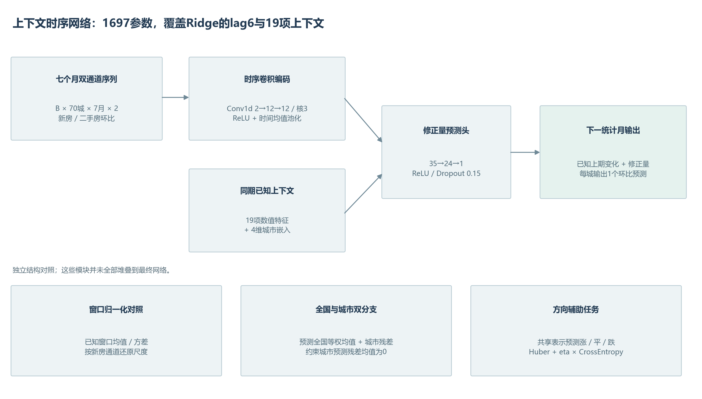
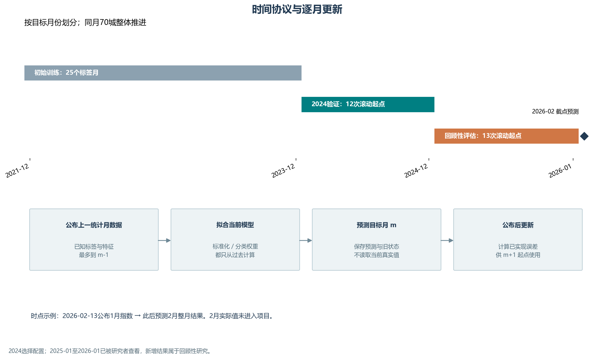

# 模型和时间评估方法

[中文](methods.zh.md) · [English](methods.en.md) · [完整结果](results.zh.md)

## 目标与信息集

城市c的目标月记为m，输入月t=m-1。目标为 $y_{c,m}=I^{new}_{c,m}-100$，即下一统计月新房价格指数环比变化。输入最多读取已公布的t月数据。在t月月报公布后执行预测，通常已进入m月中旬。

首个完整输入窗口为2021年5月至11月，首个标签月2021年12月。训练标签共有50个月；2026年2月只有预测，没有实际标签。

## 特征和信息对照

| 输入 | 数量 | 定义 |
| --- | ---: | --- |
| 当前值 | 2 | 本城t月新房、二手房环比 |
| 同期面板统计 | 3 | 70城等权新房均值、二手房均值、新房上涨城市比例 |
| 周期 | 2 | 输入月份的sin与cos编码 |
| 滞后值 | 8 | 两通道各lag1/2/3/6 |
| 滚动均值 | 4 | 两通道各3月、6月均值，包含当前月 |

共19项数值特征。Ridge另有70维城市独热编码；神经模型另有4维城市嵌入和七个月原始双通道序列，覆盖t-6至t。因此神经网络覆盖Ridge的lag6及全部显式上下文，但两个模型的输入参数化不同，网络还读取完整窗口的原始值。

原六个月原型仅覆盖t-5至t；新版本同时改变窗口和上下文预测头。0.2951到0.2791的三种子验证变化反映整个配置变化，不能只归因于多加一个月份。

## 上下文时序网络

| 模块 | 运算 | 输出形状或参数 |
| --- | --- | --- |
| 双通道序列 | 按过去训练窗口计算通道标准化 | B×70×7×2 |
| 第一层卷积 | Conv1d 2→12，kernel3，padding1，ReLU | 每城12×7 |
| 第二层卷积 | Conv1d 12→12，kernel3，padding1，ReLU | 每城12×7 |
| 时间池化 | 时间维均值 | 每城12维 |
| 上下文 | 拼接19项标准化特征与4维城市嵌入 | 每城35维 |
| 预测头 | Linear35→24，ReLU，Dropout0.15，Linear24→1 | 修正量δ |
| 输出 | $ \hat y_{c,m}=y_{c,t}+\delta_{c,m} $ | 每城一个变化预测 |

参数数目：城市嵌入280、两层卷积84与444、预测头864与25，共1697。输出层零初始化。网络不使用膨胀卷积或Transformer。

所有神经模型：AdamW学习率0.006、权重衰减0.02；Huber beta0.25；梯度裁剪1；每个滚动起点固定60轮，不用目标月标签早停。筛选种子13/31/47，最终神经与方向代表增加61/79，取预测均值。种子MAE标准差是重复训练描述量，不是时间采样置信区间。

## 独立结构消融

### 窗口归一化

参考[RevIN作者实现](https://github.com/ts-kim/RevIN)，在每城每通道的已知七个月窗口计算均值μ与标准差σ，关闭可学习仿射，σ下限0.05。序列输入为 $(x-\mu)/\sigma$，新房输出修正量乘新房σ后加到原尺度上一期变化。两个输入通道只有一个输出通道，不能把二手房统计量用于还原新房输出。19项上下文保持相同。

### 过去误差校正

以逐月Ridge alpha25为基础。已经公布的目标月误差 $e_m=\frac1{70}\sum_c(\hat y_{c,m}-y_{c,m})$；更新 $b_m=\rho b_{m-1}+(1-\rho)e_m$。下一次输出为 $\hat y^{corr}_{c,m}=\hat y_{c,m}-\lambda b_{m-1}$。

rho取0.5/0.8，lambda取0.5/1。状态2024年1月初始化为0；预测后才计算当前误差，并传到2025与最终预测。状态来自过去滚动样本外预测，不来自训练拟合残差。

### 市场与城市分解

训练月份定义 $g_m=\frac1{70}\sum_c y_{c,m}$、$r_{c,m}=y_{c,m}-g_m$。输出 $\hat y_{c,m}=\hat g_m+\hat r_{c,m}$，残差预测减去其70城均值，使预测残差均值为0。预测阶段使用预测g，不用目标月真实g。

市场分支输入17维：双通道七个月等权均值序列14项、上涨城市比例1项、周期2项。网络分支为17→12→1；训练损失为城市最终输出Huber加0.25×市场均值Huber。线性对照两个Ridge均固定alpha25，市场标签每月一条，不重复70次。

这里的市场均值是面板统计量，不是国家统计局官方全国指数。

### 方向辅助任务

未归一化双分支网络增加共享24维表示的三分类头，预测下跌/持平/上涨。损失额外加入eta×交叉熵，eta为0.01/0.05。类别权重选择无权重或过去训练频率的逆平方根、最大截至3，再归一到训练标签平均权重1。

分类概率不修改回归预测。回归三类判断持平区间固定±0.05；二元上涨判断为>0，平衡准确率排除实际持平。分类头和回归方向分别评分，并报告不一致比例。

### 线性对照与组合

NLinear形式参考[AAAI2023作者实现](https://github.com/cure-lab/LTSF-Linear)：标准化序列各通道减其窗口末值，展平14项、拼接19项特征与4维嵌入，通过单一线性输出层预测修正量，最后加回原尺度新房末值。共318参数，是加入上下文的短序列适配。

在线组合参考[OneNet研究方向](https://proceedings.neurips.cc/paper_files/paper/2023/hash/dd6a47bc0aad6f34aa5e77706d90cdc4-Abstract-Conference.html)，独立实现EWMA加softmax，不复现论文的强化学习机制。专家为验证最好的简单基线、三种子选出的非线性网络及沿用上月。风险更新为 $R_m=0.5R_{m-1}+0.5MAE_m$，预测前权重 $w_m=softmax(-R_{m-1}/0.02)$。另做均匀权重对照。

## 选择与评估

候选清单写入[锁定配置](../research/results/research/locked_experiment_registry.json)，20个单模型及2种组合，没有按后期得分追加模型。全部单模型在2024滚动验证；代表模型在后期评分前写入[选择记录](../research/results/research/selection_before_retrospective.json)。

替换主模型门槛：2024总体MAE降低≥3%，至少8个月胜过最优简单基线，任一半年误差恶化≤5%。方向门槛：相对未归一化双分支网络，整体MAE恶化≤2%，涨跌平衡准确率提高≥0.05，上涨MAE下降≥10%。这些是工程筛选门槛，不是显著性的定义。

五种子最终复核不用于更早季度选择。季度检查使用原始三种子记录，只从前3/6/9个月决定后续季度的配置与专家。组合全年验证得分使用全年选出的专家，存在额外选择不确定性。

后期评估按月份保留全部70城。统计区间使用连续三个月循环区块、20000次重采样，配对比较同月MAE。区间未校正研究者已看后期、配置筛选或潜在官方修订。2026年1月基期与权数调整，单独报告2025全年与2026年1月。

## 实现入口

| 文件 | 内容 |
| --- | --- |
| [模型实现](../research/research_models.py) | 过去范围、标准化、卷积、归一化、双分支和损失 |
| [实验运行](../research/run_research_experiments.py) | 配置、逐月拟合、种子、选模、组合与截点输出 |
| [协议核验](../research/verify_research_protocol.py) | 未来标签/特征扰动、状态顺序、输出完整性 |
| [保存权重推理](../research/predict_saved_models.py) | 不重新训练复现2026年2月预测 |

原始完成版中文报告与早期实验保留在`research/`；本页说明当前扩展，算法引用为独立适配。
