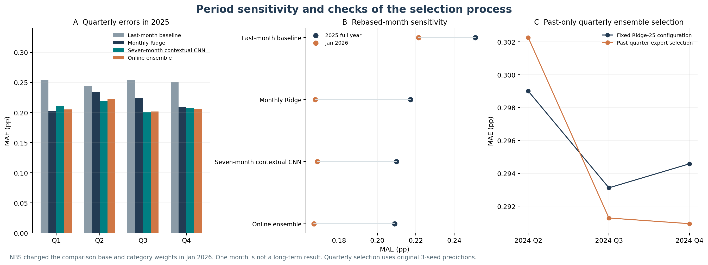
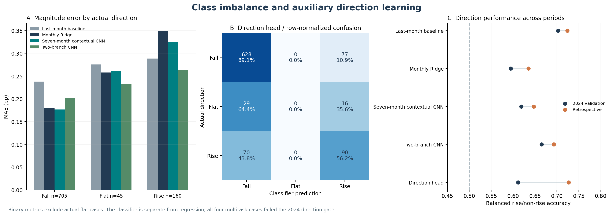

# Complete experiment results

[中文](results.zh.md) · [English](results.en.md) · [Methods](methods.en.md)

This page is generated from saved JSON/CSV outputs. MAE, RMSE, bias and gains use percentage points (pp); lower MAE is better. Jan 2025–Jan 2026 is a previously inspected historical period, so evaluation is retrospective, not a new blind test.

## All 20 single-model configurations

Screening uses the original seeds 13/31/47. Confirmation adds two seeds only for the contextual CNN and weighted direction candidate; other budgets remain unchanged. Seed SD describes individual-model MAE dispersion, not a confidence interval for averaged predictions. — means the configuration was not selected for representative evaluation.

| Case ID | Group | 3-seed screen MAE | Final val MAE | Seeds* | Seed MAE SD | Retrospective MAE |
| --- | --- | --- | --- | --- | --- | --- |
| ridge_5 | baseline | 0.2784 | 0.2784 | 1 | 0.0000 | — |
| ridge_25 | baseline | 0.2781 | 0.2781 | 1 | 0.0000 | 0.2135 |
| ridge_100 | baseline | 0.2841 | 0.2841 | 1 | 0.0000 | — |
| hgb_15 | baseline | 0.2929 | 0.2929 | 1 | 0.0000 | — |
| hgb_7 | baseline | 0.2924 | 0.2924 | 1 | 0.0000 | — |
| nlinear | baseline | 0.2853 | 0.2853 | 3 | 0.0016 | — |
| legacy_tcn | reference | 0.2951 | 0.2951 | 3 | 0.0031 | 0.2130 |
| fair_tcn | fair_input | 0.2791 | 0.2803 | 5 | 0.0026 | 0.2067 |
| revin_tcn | normalization | 0.2865 | 0.2865 | 3 | 0.0020 | 0.2097 |
| bias_0.5_0.5 | calibration | 0.2760 | 0.2760 | 1 | 0.0000 | 0.2104 |
| bias_0.5_1.0 | calibration | 0.2762 | 0.2762 | 1 | 0.0000 | — |
| bias_0.8_0.5 | calibration | 0.2776 | 0.2776 | 1 | 0.0000 | — |
| bias_0.8_1.0 | calibration | 0.2776 | 0.2776 | 1 | 0.0000 | — |
| decomp_ridge | decomposition | 0.2913 | 0.2913 | 1 | 0.0000 | 0.2032 |
| decomp_tcn | decomposition | 0.3083 | 0.3083 | 3 | 0.0091 | 0.2141 |
| decomp_revin | decomposition | 0.3091 | 0.3091 | 3 | 0.0114 | — |
| multitask_0.01_plain | direction | 0.3069 | 0.3069 | 3 | 0.0104 | — |
| multitask_0.01_weighted | direction | 0.3069 | 0.3069 | 3 | 0.0099 | — |
| multitask_0.05_plain | direction | 0.3074 | 0.3074 | 3 | 0.0098 | — |
| multitask_0.05_weighted | direction | 0.3080 | 0.3078 | 5 | 0.0122 | 0.2109 |

*A count of 1 for deterministic Ridge/tree models denotes one result; metadata seed lists do not imply repeated deterministic fits.

[Download the numeric table](tables/model_results.csv). Individual-seed scores, monthly MAE and classification metrics remain in [validation JSON](../research/results/research/validation_results.json) and [retrospective JSON](../research/results/research/retrospective_results.json).

## No-learning control and ensembles

| Case | Validation MAE | Retrospective MAE |
| --- | --- | --- |
| last_month | 0.3377 | 0.2487 |
| uniform_ensemble | 0.2826 | 0.2085 |
| online_ensemble | 0.2769 | 0.2057 |

Experts are Ridge, the contextual CNN and last month; the first two were chosen using all of 2024. Ensemble validation scores therefore include expert-selection uncertainty. Online weights update only from realized past errors; the stricter quarterly selection check appears below.

## Selection and paired uncertainty

None of the 20 configurations passes the replacement gate: at least 3% validation MAE reduction, at least eight improved months, and no half-year deterioration over 5%. ridge_25 remains primary. None of the four direction cases passes its gate. Decomposed Ridge has the lowest later-period MAE, but is not promoted using that outcome.

| Compared with Ridge | Mean monthly MAE gain | 95% lower | Upper | Improved months / 13 |
| --- | --- | --- | --- | --- |
| bias_0.5_0.5 | 0.0031 | -0.0040 | 0.0126 | 6 |
| decomp_ridge | 0.0102 | -0.0005 | 0.0252 | 7 |
| decomp_tcn | -0.0007 | -0.0186 | 0.0220 | 5 |
| fair_tcn | 0.0067 | -0.0049 | 0.0206 | 7 |
| legacy_tcn | 0.0005 | -0.0187 | 0.0209 | 5 |
| multitask_0.05_weighted | 0.0026 | -0.0145 | 0.0242 | 5 |
| revin_tcn | 0.0037 | -0.0102 | 0.0215 | 6 |
| last_month | -0.0352 | -0.0499 | -0.0146 | 1 |
| online_ensemble | 0.0078 | -0.0011 | 0.0190 | 9 |
| uniform_ensemble | 0.0049 | -0.0080 | 0.0215 | 6 |

Gain = Ridge MAE minus candidate MAE; positive favors the candidate. Intervals use 20,000 circular three-month block resamples. With only 13 temporal points and model selection, these are descriptive intervals, not evidence from an independent blind test.

## Period breakdown

| Period | last_month | ridge_25 | fair_tcn | decomp_ridge | online_ensemble |
| --- | --- | --- | --- | --- | --- |
| 2025_Q1 | 0.2543 | 0.2021 | 0.2114 | 0.2015 | 0.2053 |
| 2025_Q2 | 0.2438 | 0.2341 | 0.2193 | 0.2145 | 0.2219 |
| 2025_Q3 | 0.2543 | 0.2237 | 0.2013 | 0.1986 | 0.2018 |
| 2025_Q4 | 0.2514 | 0.2092 | 0.2076 | 0.2098 | 0.2067 |
| 2025_Jun_Aug | 0.2419 | 0.2503 | 0.2138 | 0.2060 | 0.2172 |
| 2025_only | 0.2510 | 0.2173 | 0.2099 | 0.2061 | 0.2089 |
| 2026_Jan_only | 0.2214 | 0.1677 | 0.1688 | 0.1688 | 0.1671 |

In June–August 2025, CNN MAE is 14.6% below Ridge. In January 2026 the CNN does not outperform Ridge. The 2025-only and January 2026 rows expose sensitivity to the base/category-weight adjustment month.

## Direction and reversals

Retrospective actual labels: 705 falling, 160 rising and 45 flat. Three-way regression signs use a ±0.05 pp flat band; binary rise uses >0, with balanced accuracy excluding actual zeros. Auxiliary-head argmax predictions are reported separately.

| Case | Rising MAE | Falling MAE | Regression binary balanced accuracy |
| --- | --- | --- | --- |
| last_month | 0.2888 | 0.2379 | 72.39% |
| ridge_25 | 0.3491 | 0.1798 | 63.51% |
| fair_tcn | 0.3247 | 0.1765 | 64.72% |
| decomp_tcn | 0.2629 | 0.2019 | 69.30% |
| multitask_0.05_weighted | 0.2667 | 0.1971 | 69.98% |

The weighted direction head has retrospective rise recall 56.25% and rise precision 49.18%. Counts for actual fall/flat/rise are [628,0,77], [29,0,16] and [70,0,90] across predicted fall/flat/rise. It never predicts flat and does not pass its validation direction gate, so it does not replace the primary model.

## All cities and Shandong examples

The [70-city × 11-method MAE table](tables/all_city_mae.csv) contains 770 rows. The four Shandong examples below each have 13 months; learned models underperform last month in Jining.

| City | last_month | ridge_25 | fair_tcn | online_ensemble |
| --- | --- | --- | --- | --- |
| 济南 | 0.2385 | 0.1683 | 0.1742 | 0.1798 |
| 济宁 | 0.1462 | 0.1710 | 0.1571 | 0.1556 |
| 烟台 | 0.2769 | 0.2209 | 0.2082 | 0.2100 |
| 青岛 | 0.1615 | 0.1201 | 0.1243 | 0.1229 |

## Selection using past quarters only

| Choose through | Evaluate from | Baseline expert | Neural expert | Online MAE | Uniform MAE | Ridge25 MAE |
| --- | --- | --- | --- | --- | --- | --- |
| 2024-03 | 2024-04 | ridge_100 | fair_tcn | 0.3023 | 0.3062 | 0.2990 |
| 2024-06 | 2024-07 | ridge_25 | fair_tcn | 0.2913 | 0.2938 | 0.2931 |
| 2024-09 | 2024-10 | ridge_25 | fair_tcn | 0.2909 | 0.3069 | 0.2946 |

These choices use original three-seed screening predictions only. Five-seed full-year confirmation never enters earlier-quarter selection. Online averaging does not improve Q2 and gives small gains in Q3/Q4; full-validation expert selection is not a pure out-of-time check.

## Outputs and audits

- [Original three-seed screening](../research/results/research/validation_screening_results.json)
- [All 2024 predictions](../research/results/research/validation_predictions_2024.csv)
- [All retrospective predictions](../research/results/research/retrospective_predictions.csv)
- [February 2026 output without actual labels](../research/results/research/forecast_2026_02.csv)
- [315 training-cutoff audit records](../research/results/research/training_cutoff_audit.csv)
- [Error decomposition and 72 non-rise-to-rise cases](../research/results/research/error_decomposition.json)
- [Selection record](../research/results/research/selection_before_retrospective.json)
- [Final primary/neural checkpoints](../research/results/research/models/)
