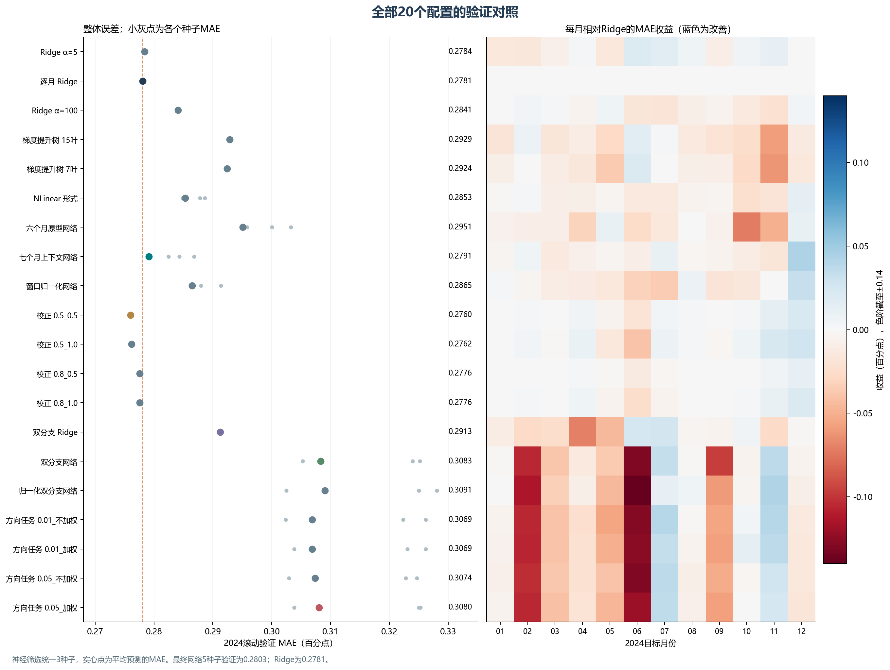
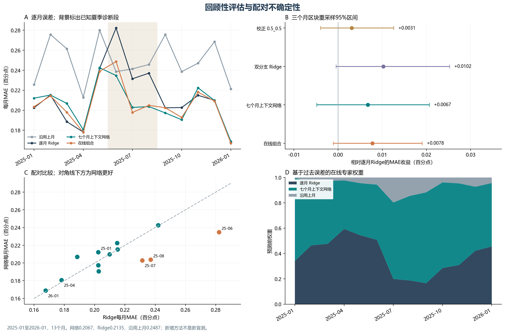
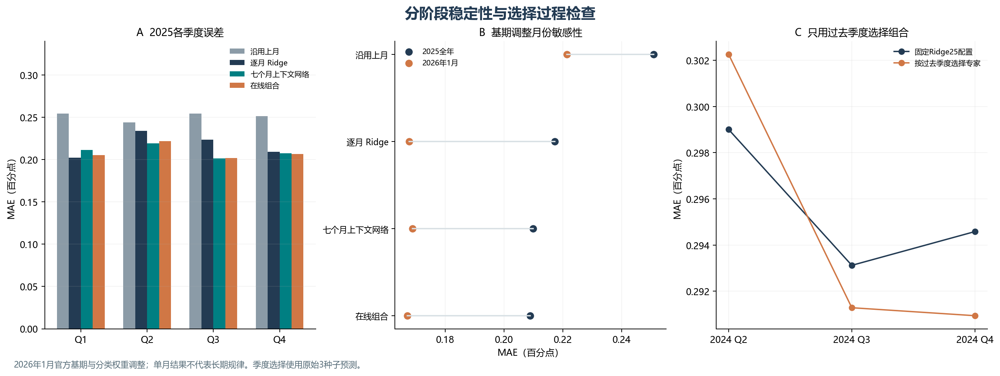
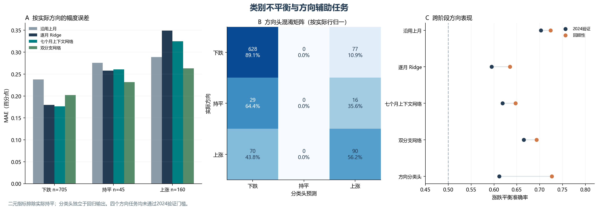
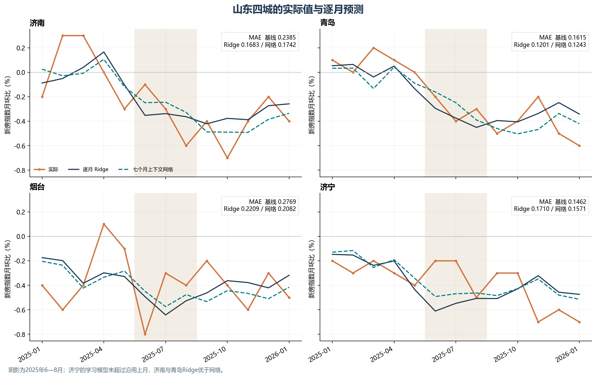

# 完整实验结果

[中文](results.zh.md) · [English](results.en.md) · [方法](methods.zh.md)

本页由保存的 JSON / CSV 自动生成。MAE、RMSE、偏差及增益均以百分点（pp）计；MAE越低越好。2025-01至2026-01属于已观察过历史期间的回顾性评估，不是新的盲测。

## 20个单模型配置

筛选列使用原始3种子13/31/47；确认列仅对七个月网络和加权方向模型增至5种子，其他配置保持原预算。种子标准差是各独立模型MAE的离散程度，不是种子平均预测的置信区间。— 表示该配置未进入后续代表模型评估。

| 配置ID | 组别 | 3种子筛选MAE | 最终验证MAE | 种子数* | 种子MAE标准差 | 回顾性MAE |
| --- | --- | --- | --- | --- | --- | --- |
| ridge_5 | baseline | 0.2784 | 0.2784 | 1 | 0.0000 | — |
| ridge_25 | baseline | 0.2781 | 0.2781 | 1 | 0.0000 | 0.2135 |
| ridge_100 | baseline | 0.2841 | 0.2841 | 1 | 0.0000 | — |
| hgb_15 | baseline | 0.2929 | 0.2929 | 1 | 0.0000 | — |
| hgb_7 | baseline | 0.2924 | 0.2924 | 1 | 0.0000 | — |
| nlinear | baseline | 0.2853 | 0.2853 | 3 | 0.0016 | — |
| legacy_tcn | reference | 0.2951 | 0.2951 | 3 | 0.0031 | 0.2130 |
| fair_tcn | fair_input | 0.2791 | 0.2803 | 5 | 0.0026 | 0.2067 |
| revin_tcn | normalization | 0.2865 | 0.2865 | 3 | 0.0020 | 0.2097 |
| bias_0.5_0.5 | calibration | 0.2760 | 0.2760 | 1 | 0.0000 | 0.2104 |
| bias_0.5_1.0 | calibration | 0.2762 | 0.2762 | 1 | 0.0000 | — |
| bias_0.8_0.5 | calibration | 0.2776 | 0.2776 | 1 | 0.0000 | — |
| bias_0.8_1.0 | calibration | 0.2776 | 0.2776 | 1 | 0.0000 | — |
| decomp_ridge | decomposition | 0.2913 | 0.2913 | 1 | 0.0000 | 0.2032 |
| decomp_tcn | decomposition | 0.3083 | 0.3083 | 3 | 0.0091 | 0.2141 |
| decomp_revin | decomposition | 0.3091 | 0.3091 | 3 | 0.0114 | — |
| multitask_0.01_plain | direction | 0.3069 | 0.3069 | 3 | 0.0104 | — |
| multitask_0.01_weighted | direction | 0.3069 | 0.3069 | 3 | 0.0099 | — |
| multitask_0.05_plain | direction | 0.3074 | 0.3074 | 3 | 0.0098 | — |
| multitask_0.05_weighted | direction | 0.3080 | 0.3078 | 5 | 0.0122 | 0.2109 |

*确定性Ridge/树模型的计数1表示一个结果，未因元数据中的种子列表重复拟合。

[下载数值表](tables/model_results.csv)。逐种子成绩、逐月MAE和完整分类指标保留在[最终验证JSON](../research/results/research/validation_results.json)与[回顾性JSON](../research/results/research/retrospective_results.json)。

## 无学习基线与组合

| 配置 | 验证MAE | 回顾性MAE |
| --- | --- | --- |
| last_month | 0.3377 | 0.2487 |
| uniform_ensemble | 0.2826 | 0.2085 |
| online_ensemble | 0.2769 | 0.2057 |

组合专家为Ridge、七个月网络和沿用上月；前两者由完整2024验证期选出。因此上表组合验证成绩包含专家选择不确定性。在线权重只用已经实现的过去误差更新；更严格的季度选择结果见下。

## 选择结论与配对不确定性

全部20个配置均未通过替换门槛：验证MAE至少改善3%、至少8个月改善、上下半年均不恶化超过5%。主模型保留ridge_25。四个方向配置也均未通过方向替换门槛。双分支Ridge的后续成绩最低，但不以此倒推选择主模型。

| 相对Ridge的配置 | 平均月度MAE增益 | 95%区间下界 | 上界 | 改善月份/13 |
| --- | --- | --- | --- | --- |
| bias_0.5_0.5 | 0.0031 | -0.0040 | 0.0126 | 6 |
| decomp_ridge | 0.0102 | -0.0005 | 0.0252 | 7 |
| decomp_tcn | -0.0007 | -0.0186 | 0.0220 | 5 |
| fair_tcn | 0.0067 | -0.0049 | 0.0206 | 7 |
| legacy_tcn | 0.0005 | -0.0187 | 0.0209 | 5 |
| multitask_0.05_weighted | 0.0026 | -0.0145 | 0.0242 | 5 |
| revin_tcn | 0.0037 | -0.0102 | 0.0215 | 6 |
| last_month | -0.0352 | -0.0499 | -0.0146 | 1 |
| online_ensemble | 0.0078 | -0.0011 | 0.0190 | 9 |
| uniform_ensemble | 0.0049 | -0.0080 | 0.0215 | 6 |

增益=Ridge误差−候选误差；正数代表候选更好。按月份成块的3个月循环自助法，20,000次重采样。只有13个时间点且存在模型选择，这些是描述性区间，不构成独立盲测的显著性证明。

## 分段表现

| 期间 | last_month | ridge_25 | fair_tcn | decomp_ridge | online_ensemble |
| --- | --- | --- | --- | --- | --- |
| 2025_Q1 | 0.2543 | 0.2021 | 0.2114 | 0.2015 | 0.2053 |
| 2025_Q2 | 0.2438 | 0.2341 | 0.2193 | 0.2145 | 0.2219 |
| 2025_Q3 | 0.2543 | 0.2237 | 0.2013 | 0.1986 | 0.2018 |
| 2025_Q4 | 0.2514 | 0.2092 | 0.2076 | 0.2098 | 0.2067 |
| 2025_Jun_Aug | 0.2419 | 0.2503 | 0.2138 | 0.2060 | 0.2172 |
| 2025_only | 0.2510 | 0.2173 | 0.2099 | 0.2061 | 0.2089 |
| 2026_Jan_only | 0.2214 | 0.1677 | 0.1688 | 0.1688 | 0.1671 |

2025年6—8月，七个月网络MAE比Ridge低14.6%；2026年1月网络未优于Ridge。2025全年与2026年1月单独报告，以观察基期/分类权重调整月份的敏感性。

## 方向与反转

回顾性实际标签：下跌705、上涨160、持平45。预测回归值的三分类采用±0.05 pp持平区间；二分类上涨为>0，平衡准确率排除实际为0的记录。辅助分类头的argmax结果单独报告。

| 配置 | 上涨MAE | 下跌MAE | 回归值二类平衡准确率 |
| --- | --- | --- | --- |
| last_month | 0.2888 | 0.2379 | 72.39% |
| ridge_25 | 0.3491 | 0.1798 | 63.51% |
| fair_tcn | 0.3247 | 0.1765 | 64.72% |
| decomp_tcn | 0.2629 | 0.2019 | 69.30% |
| multitask_0.05_weighted | 0.2667 | 0.1971 | 69.98% |

加权方向分类头回顾性上涨召回率56.25%、上涨精确率49.18%；真实下跌/持平/上涨三行的预测数量分别为[628,0,77]、[29,0,16]、[70,0,90]。该头未输出持平类别；其验证平衡准确率未通过方向门槛，不能作为主模型替代。

## 全部城市与山东案例

[70城×11方法的城市MAE表](tables/all_city_mae.csv)含770行。山东四城成绩如下，每城13个月；济宁的学习模型均未优于沿用上月。

| 城市 | last_month | ridge_25 | fair_tcn | online_ensemble |
| --- | --- | --- | --- | --- |
| 济南 | 0.2385 | 0.1683 | 0.1742 | 0.1798 |
| 济宁 | 0.1462 | 0.1710 | 0.1571 | 0.1556 |
| 烟台 | 0.2769 | 0.2209 | 0.2082 | 0.2100 |
| 青岛 | 0.1615 | 0.1201 | 0.1243 | 0.1229 |

## 只使用过去季度选择的检查

| 选择信息截至 | 评估季度起点 | 基线专家 | 神经专家 | 在线MAE | 均匀MAE | Ridge25 MAE |
| --- | --- | --- | --- | --- | --- | --- |
| 2024-03 | 2024-04 | ridge_100 | fair_tcn | 0.3023 | 0.3062 | 0.2990 |
| 2024-06 | 2024-07 | ridge_25 | fair_tcn | 0.2913 | 0.2938 | 0.2931 |
| 2024-09 | 2024-10 | ridge_25 | fair_tcn | 0.2909 | 0.3069 | 0.2946 |

上述选择仅用原始3种子筛选预测。5种子全年确认不会参与更早季度的选择。在线组合在第二季度未改善，在第三、四季度小幅改善，不能把完整验证期的专家选择成绩当作纯时间外检验。

## 输出与审计索引

- [原始3种子筛选](../research/results/research/validation_screening_results.json)
- [2024全部预测](../research/results/research/validation_predictions_2024.csv)
- [回顾性全部预测](../research/results/research/retrospective_predictions.csv)
- [2026-02预测，无实际标签](../research/results/research/forecast_2026_02.csv)
- [315条训练截止审计](../research/results/research/training_cutoff_audit.csv)
- [误差分解与72次由非上涨转上涨诊断](../research/results/research/error_decomposition.json)
- [选择记录](../research/results/research/selection_before_retrospective.json)
- [主模型和神经模型最终权重](../research/results/research/models/)
