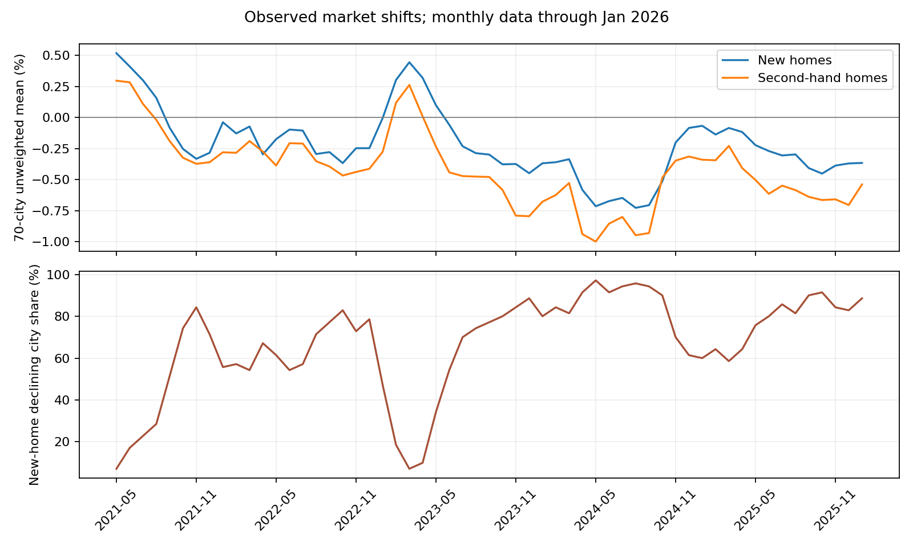
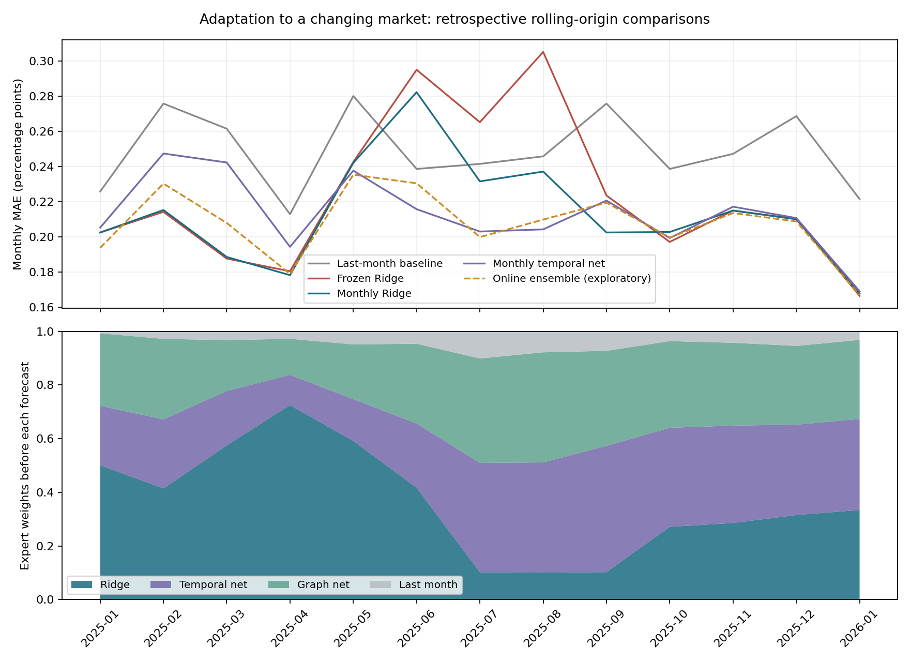

# 中国 70 城新房价格指数预测：算法与数据项目

**English title:** *Adaptive Forecasting of New-Home Price Movements Across 70 Chinese Cities under Changing Market Conditions*

项目模拟 **2026 年 2 月 28 日**的研究视角：只使用此前公布的中国内地官方数据，预测下一月的新建商品住宅价格指数环比变化。山东的济南、青岛、烟台、济宁是重点分析城市。交付重点是**数据构建、特征工程、模型、时间验证、误差诊断与可复现代码**。

**当前版本已完成（2026-10-04）。** 完成 20 个单模型配置和 2 种组合的算法研究，以及最终神经候选五种子复核。已交付模型权重、逐月预测、输入与结构消融、山东案例和中文展示 PDF。所有新增回测属于回顾性研究。预测在上一统计月月报公布后执行，通常已进入目标月中旬。

[最终实验报告](最终实验报告.md)给出完整方法、结果和研究边界；[项目介绍与面试准备](项目介绍与面试准备.md)可用于理解和讲述项目。[实验前计划](下一轮实验计划.md)保留预先限定的参数、门槛和完成状态。

## 最新可展示成果

| 方法 | 2024滚动验证MAE | 2025-01至2026-01回顾性MAE | 角色 |
| --- | ---: | ---: | --- |
| 沿用上月 | 0.3377 | 0.2487 | 无学习基线 |
| 逐月Ridge | 0.2781 | 0.2135 | 验证支持的主模型 |
| 七个月与19项上下文的神经网络 | 0.2803 | 0.2067 | 五种子研究成果，1697参数 |
| 偏差校正Ridge | 0.2760 | 0.2104 | 验证改善0.75%，未过3%替换门槛 |
| 双分支Ridge | 0.2913 | 0.2032 | 回顾性较好，验证较差 |
| 在线组合 | 0.2769 | 0.2057 | 专家选择后的探索性组合 |

单位为百分点。新网络相对沿用上月降低16.9%，相对逐月Ridge降低3.2%；后者的三个月区块收益区间跨0，且网络未通过验证替换门槛，主模型仍为Ridge。预测目标是城市月度指数变化，未验证实际楼盘定价或销售提升。

- [中文成果展示PDF](output/pdf/70城新房指数预测_成果展示.pdf)
- [最终实验报告](最终实验报告.md)与[模型结构图](results/research/model_architecture.png)
- [完整验证对照](results/research/model_comparison.csv)、[逐条回顾性预测](results/research/retrospective_predictions.csv)、[2026年2月截点预测](results/research/forecast_2026_02.csv)
- [时间协议核验](results/research/protocol_verification.json)与[保存权重复现核验](results/research/checkpoint_verification.json)

## 当前版本的运行方式

项目已附带清洗数据和最终模型。建议使用Python 3.11及`requirements-tested.txt`中的实测版本。安装依赖后可直接复现预测；完整实验不需要重新采集网页。

```powershell
python -m pip install -r requirements-tested.txt
python -m pip install torch==2.5.1 --index-url https://download.pytorch.org/whl/cpu
python -m pip install 'threadpoolctl>=3.1,<4'
python predict_saved_models.py
```

完整训练和核验：

```powershell
python run_research_experiments.py
python analyze_research_results.py
python verify_research_protocol.py
python predict_saved_models.py
python write_research_report.py
python package_project.py
```

`results/research/`保存锁定配置、全部2024验证、代表模型回顾性评估、逐月截止、校正状态、模型权重与核验结果。训练缓存可复用但不进入申请包。下文保留早期研究版本，当前结论以最终实验报告为准。

## 一分钟了解项目

| 项目 | 内容 |
| --- | --- |
| 官方数据 | 国家统计局 2021-05 至 2026-01 的 57 个月月报；70 城 × 57 月 = 3,990 条，缺失值为 0 |
| 最新可用月报 | [2026 年 1 月指数](https://www.stats.gov.cn/sj/zxfb/202602/t20260213_1962617.html)，2026-02-13 发布 |
| 预测目标 | 每城下一月新房价格指数的环比变化，单位是百分比/百分点；**不是元/平方米** |
| 建模 | Ridge、小型时序/图时序网络；逐月更新、窗口与降权对照、在线专家加权 |
| 验证 | 原冻结实验保留；新方案用 2024 年滚动验证选策略，2025-01 至 2026-01 做回顾性滚动评估 |
| 当前结果 | 逐月 Ridge 回顾性 MAE **0.2135 个百分点**；原冻结 Ridge **0.2234**；沿用上月 **0.2487** |
| 关键不足 | 上涨样本与夏季仍有误差；在线组合虽回顾性更好，但验证期未胜出；新增结果不是新盲测 |

国家统计局的表格写作“上月 = 100”。例如指数 99.7 对应环比 **-0.3%**。项目使用的是**城市级相对变化**，不能推算某个楼盘或某套房的成交单价。2026 年 2 月真实指数在截点尚未发布，因而没有被用于特征、选模或最终预测的事后修正。

## 运行

```powershell
python -m pip install -r requirements.txt
python download_official_data.py
python train_forecast.py
python analyze_model.py
```

可选的进阶实验需要 PyTorch CPU 版，在上述依赖安装完成后运行：

```powershell
python -m pip install torch==2.5.1 --index-url https://download.pytorch.org/whl/cpu
python train_graph_temporal.py
python train_adaptive_backtest.py
python train_online_ensemble.py
python verify_adaptive_protocol.py
```

项目附带清洗后的 `data/official_nbs_70city.csv`，可直接从第三行训练；第一行采集命令用于重新核查国家统计局的 57 个原始页面。网页缓存放在 `data/official_pages/`，不纳入版本管理。采集脚本检查官方域名、发布时间、连续月份、每月 70 城和新房/二手房城市集合一致性。
`data_manifest.json` 记录本次重建时间和数据文件校验值。本项目是按 2026-02-28 可用信息做的**历史重建实验**；对外展示应填写真实开发时间。
运行 `python package_project.py` 可重新生成上级目录中的 `70城房价预测-申请展示.zip`；它只包含代码、清洗数据、结果和文档，排除训练环境与网页缓存。

## 阅读顺序

1. [算法与实验说明](算法与实验说明.md)：问题形式化、字段字典、特征公式、时间划分、统计诊断、城市图时序网络，以及第 9 节新增的市场变化与自适应流程。
2. [研究报告](研究报告.md)：面向实习与研究生申请的问题背景、结果解读和可讲述的项目贡献。
   [申请展示提纲](申请展示提纲.md)提供 90 秒介绍、五页展示结构和常见追问的回答。
3. [数据采集代码](download_official_data.py)与[训练代码](train_forecast.py)：完整可复现实现；[诊断代码](analyze_model.py)只分析既定模型；[进阶模型代码](train_graph_temporal.py)实现轻量图时序网络。
4. [来源索引](source_index.csv)与 `data/official_nbs_70city.csv`：逐月原始官方链接和逐条数据来源。
   [数据清单](data_manifest.json)记录确切文件版本与重建时间。
5. `results/metrics.json`、`results/diagnostics.json`、`results/backtest_2025_to_2026_01.csv`、`results/forecast_2026_02.csv`：机器可读的实验结果。
6. [自适应回测代码](train_adaptive_backtest.py)、[在线组合代码](train_online_ensemble.py)和[时间核验代码](verify_adaptive_protocol.py)：`results/adaptive/` 保存新的逐条预测、各月训练截止、模型权重、前瞻输出与检查结果。

## 原冻结实验：方法和结果

输入月份记为 `t`，标签是 `t+1` 月的指数环比变化。训练目标月至 2023-12，2024 年做模型选择，2025-01 至 2026-01 做一次冻结模型的独立测试。同一目标月的 70 城始终在同一阶段，模型只看见预测时已经发布的月份。

| 方法 | 2024 验证 MAE | 2025-01 至 2026-01 测试 MAE |
| --- | ---: | ---: |
| 沿用上月变化 | 0.3377 | 0.2487 |
| Ridge | **0.2787** | **0.2234** |
| 梯度提升树 | 0.3065 | 0.2094 |

单位均为百分点。Ridge 在验证期胜出，所以它是预先选定的主模型；梯度提升树虽然在测试期更准，不能依据测试结果追认。Ridge 的测试 MAE 较沿用上月低约 **10.2%**，但 3 个月区块重采样得到的 MAE 收益 95% 描述性区间为 **[-0.0068, 0.0495]** 个百分点，跨过 0。结论是样本中的总体误差改善，不能保证未来持续胜出。

## 使用边界

2026 年 1 月起，[国家统计局在该期月报附注中说明采用 2025 年为新一轮对比基期并调整分类权数](https://www.stats.gov.cn/sj/zxfb/202602/t20260213_1962617.html)。因此另报告去掉 2026 年 1 月后的 2025 年单独结果。缺少楼盘成交、供给、营销和客户数据，不能把城市指数当作开发商项目定价模型。

## 进阶研究结果

参考 [AGCRN（NeurIPS 2020）](https://proceedings.neurips.cc/paper/2020/hash/ce1aad92b939420fc17005e5461e6f48-Abstract.html)与 [MTGNN（KDD 2020）](https://github.com/nnzhan/MTGNN)，另实现了小型时间卷积 + 城市嵌入 + 邻居聚合网络，并对比无图、原始城市相关图、去全国趋势后的相关图。去趋势图的验证 MAE **0.294761**，无图 **0.294818**，差距极小；两者均不及 Ridge 的 **0.2787**。结果表明本数据尚不能支持“增加图结构必定提高预测”的说法。[算法与实验说明](算法与实验说明.md)逐项说明其公式和实验边界。由于原测试期在加入此模型前已经被检查过，新模型的 2025 年结果只作**探索性历史比较**。

## 市场变化下的自适应实验

数据中的 70 城等权平均新房月环比，2022 年为 -0.196%，2024 年为 -0.493%，2025 年为 -0.260%。旧时期也有下跌，而不同阶段跌幅、上涨城市比例与城市关联发生变化。不能仅把 2023 年前当成上涨样本，也不能把全部年份打乱来消除差异。

新协议在预测目标月 `m` 时，只用截至 `m-1` 已公布的标签重训；其后收到 `m` 的真实值，才能用于预测 `m+1`。所有 70 城一起推进时间。模型、标准化和图均遵循同一截止。

| 方法 | 2024 滚动验证 MAE | 2025-01—2026-01 回顾性 MAE | 2025 夏季 MAE |
| --- | ---: | ---: | ---: |
| 沿用上月 | 0.3377 | 0.2487 | 0.2419 |
| 原冻结 Ridge | 0.2787（原固定验证） | 0.2234 | 0.2884 |
| 逐月 Ridge | **0.2781** | 0.2135 | 0.2503 |
| 逐月无图时序网络 | 0.2957 | 0.2128 | **0.2076** |
| 逐月去趋势图网络 | 0.2963 | 0.2141 | 0.2132 |
| 过去误差加权的在线组合 | 0.2832 | **0.2072** | 0.2133 |

单位为百分点；夏季指 2025 年 6—8 月。2024 验证仍支持**逐月更新的 Ridge**；三类模型均选择保留全部历史的逐月重训策略，24 个月截断和 12 个月半衰期降权未胜出。在线组合借鉴 [OneNet（NeurIPS 2023）](https://proceedings.neurips.cc/paper_files/paper/2023/hash/dd6a47bc0aad6f34aa5e77706d90cdc4-Abstract-Conference.html)的在线组合思路，是独立的 EWMA + softmax 简化算法，没有复现其强化学习设计。不能依据它更好的回顾性得分将其追认为主模型。




