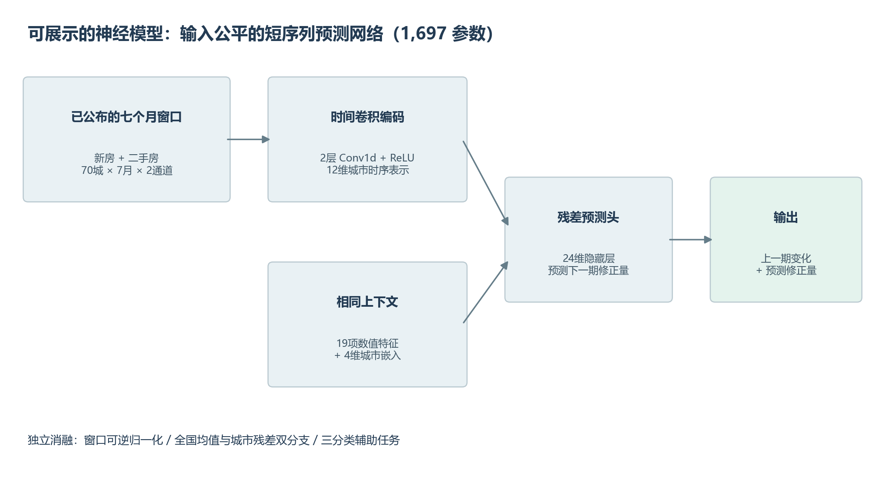
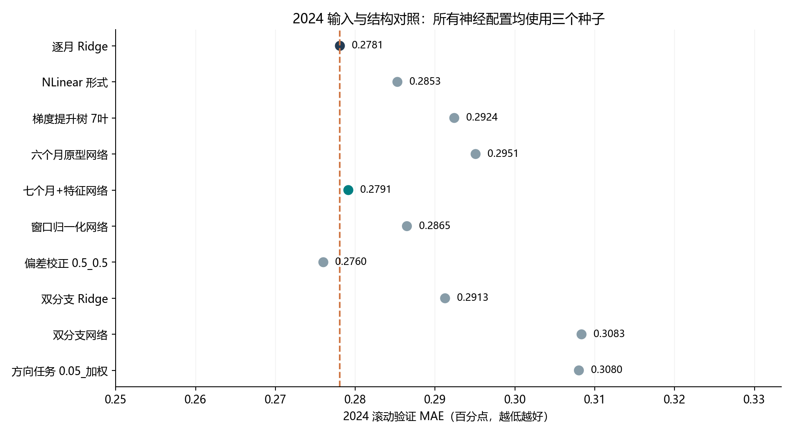
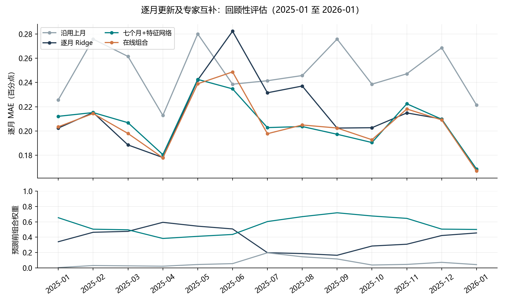
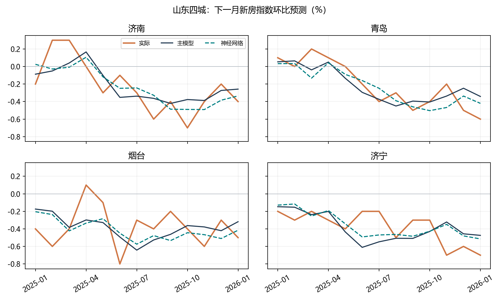

# 中国70城新房指数自适应预测最终实验报告

本项目为山东房地产开发商实习场景构建公开数据的城市市场研判方法，重点展示数据治理、短序列神经网络、分布变化适应和严格的时间评估。预测量是每城下一统计月的新建商品住宅价格指数环比变化，单位为百分点。项目已完成锁定的20个单模型配置、2个组合配置及代表模型的五种子复核，交付代码、数据、完整验证结果、回顾性预测、模型权重与中文展示材料。

**完成日期：2026年10月4日。信息截点：2026年2月28日。真实数据截止：2026年1月。** 本项目围绕2026年3月实习场景做历史重建和后续完善，对外应如实填写实际开发时间。已知的2025年至2026年1月结果参与过此前问题诊断，因此新增评估属于回顾性研究。

## 1 研究结论

1. 输入补齐版本网络的三种子验证MAE从六个月原型的 0.2951 降至 0.2791，缩小了与逐月Ridge的差距。五种子复核为 0.2803，仍略高于Ridge的 0.2781。这一对照同时改变了输入窗口及上下文预测头，不能把全部改善只归因于增加一个月份。
2. 补齐输入的网络在2025年1月至2026年1月回顾性MAE为 **0.2067**，相对沿用上月的 0.2487 降低 **16.9%**，相对逐月Ridge降低 **3.2%**。收益相对Ridge的三个月区块重采样95%区间为 **[-0.0049, 0.0206]**，跨过0，不能认定稳定胜出。
3. **主预测模型保留逐月Ridge。** 新网络没有达到预设的2024验证误差降低3%、至少8个月改善和半年误差约束。低得分的回顾性模型不能因此追认为主模型。
4. 近期偏差校正验证误差为 0.2760，仅较Ridge降低 0.75%，未通过3%门槛。窗口归一化、双分支和方向任务均未带来稳定验证收益。双分支Ridge回顾性误差 0.2032 更低，但其验证误差 0.2913 较差。
5. 在线组合回顾性MAE为 0.2057。组合的专家先由2024全年选择，验证得分存在额外选择不确定性；不能视作独立证明。

## 2 数据来源和业务问题

数据来自国家统计局[70城住宅销售价格月报](https://www.stats.gov.cn/sj/zxfb/202602/t20260213_1962617.html)，覆盖2021年5月至2026年1月，57个月、70城，共3990条城市月度记录，无缺失和重复。每条记录保留官方来源链接。字段为月份、城市、新房环比、二手房环比及来源URL。

原表“上月=100”的指数减去100得到月度变化，例如99.7转为-0.3%。它不能直接转换为楼盘成交单价。山东案例使用济南、青岛、烟台、济宁，可为区域营销节奏和市场变化提供研究参考；没有公司销售及客户数据，未验证销量提升或实际部署效果。

**预测时点须与公布时点一致。** 例如2026年1月指数于2月13日公布，项目在获知该指数后预测2月整月指数。这是当月中旬之后的月度结果预测，不能声称2月1日就已知1月数据。所有历史起点同样在输入月月报公布之后执行，预测月份的实际值要到后续公布才能用于下一起点。

网页于2026年9月28日重新采集。`data_manifest.json`和本轮清单保存文件校验值；没有原始发布日期的网页快照，不能证明页面从未事后修订。2026年2月真实值未加载。2026年1月新一轮基期与分类权重变化可能影响可比性，单独报告2025全年及2026年1月。

## 3 时间协议

| 阶段 | 目标月份 | 第一个起点的训练标签 | 最后一个起点的训练标签 |
| --- | --- | --- | --- |
| 滚动验证与选配置 | 2024-01至2024-12 | 2021-12至2023-12，25月1750行 | 2021-12至2024-11，36月2520行 |
| 回顾性滚动评估 | 2025-01至2026-01 | 2021-12至2024-12，37月2590行 | 2021-12至2025-12，49月3430行 |
| 截点预测 | 2026-02 | 2021-12至2026-01，50月3500行 | 同左 |

每个目标月m仅用已经公布的m-1及更早标签拟合。特征标准化、全国分支、类别权重均使用同一过去训练范围；预测完m月后，等其真实值公布，才能更新误差状态和m+1起点。所有70城同时推进，未随机打乱月份。

2024全年结果用于锁定代表模型；另用原始三种子预测做季度检查：前三个月选第二季度、前六个月选第三季度、前九个月选第四季度。五种子复核不进入这些季度选择，以免把全年筛选结果带入更早季度。季度组合专家也只由此前季度决定，记录在`quarterly_causal_ensemble_check.json`。

## 4 输入和算法设计

### 相同已知信息

基准Ridge使用19项数值特征加70维城市独热编码。神经网络使用七个月的新房和二手房双通道序列，并显式读取相同19项特征和4维城市嵌入。七个月窗口覆盖输入月t-6至t，允许读取Ridge的lag6。各模型具有城市身份信息，但编码方式和参数化不同。

| 特征组 | 数量 | 内容 |
| --- | ---: | --- |
| 当前值 | 2 | 本城新房与二手房环比 |
| 同期面板信息 | 3 | 70城等权新房均值、二手房均值、新房上涨城市比例 |
| 输入月周期 | 2 | sin与cos月份编码 |
| 历史滞后 | 8 | 两通道各lag1、2、3、6 |
| 滚动均值 | 4 | 两通道各3月和6月均值 |

70城等权均值仅是本面板描述量，并非官方全国房价指数。

### 可展示的神经网络

输入张量为批次×70城×7月×2通道。两层Conv1d分别2→12、12→12，卷积核3、padding1、ReLU，时间维均值池化得到12维时序表示。拼接19项特征和4维城市嵌入，35维输入经24维ReLU及Dropout0.15，再输出1维修正量。最终预测=已知上一期新房变化+修正量，输出层零初始化。共**1697个可训练参数**，总预算不超过5000。

所有神经配置采用AdamW，学习率0.006、权重衰减0.02、Huber beta0.25、梯度裁剪1，每个起点固定60轮。筛选种子13/31/47，最终网络和方向代表复核种子13/31/47/61/79。各个种子单独训练，最终取预测均值；种子MAE标准差不是置信区间。



### 预先限定的扩展方法

| 方法 | 固定设计 | 配置数及作用 |
| --- | --- | --- |
| Ridge | alpha为5、25、100 | 3，强线性基线 |
| 梯度提升树 | 120轮、叶节点7或15、学习率0.05 | 2，同时间协议的非线性基线 |
| NLinear形式 | 各通道减窗口末值，拼接上下文，线性修正后加回新房末值 | 1，318参数的短序列线性对照 |
| 六个月原型及输入补齐网络 | 固定训练预算，比较信息覆盖 | 2 |
| RevIN形式 | 每城已知窗口均值方差归一化，仅按新房通道还原；标准差下限0.05、关闭仿射 | 1 |
| 近期误差校正 | Ridge25过去样本外平均有符号误差的EWMA；rho为0.5或0.8，修正强度0.5或1 | 4 |
| 全国与城市分解 | 预测均值g和零均值城市残差r，输出g+r；线性、神经及归一化版本 | 3 |
| 方向辅助任务 | 双分支网络加三分类头，eta为0.01或0.05，训练频率加权或不加权 | 4 |
| 专家组合 | 最强简单模型、最优非线性网络、沿用上月；均匀或EWMA权重 | 2 |

校正的有符号误差为e=平均(预测-真实)，偏差状态b←rho×b+(1-rho)×e，下一起点预测减strength×旧b。状态从2024年1月0初始化，依次传到2025及最终预测。

双分支标签定义g=70城实际平均，r=y-g，只在训练月份使用真实g。预测用g_hat而非目标月真实均值。城市残差头减去其70城预测平均使其为0；全国分支输入17维，包括双通道七个月均值序列14项、上涨比例与周期3项。神经损失=最终城市Huber+0.25×市场均值Huber。

方向头与城市回归共享表示，增加eta×三分类交叉熵。权重仅从过去训练标签计算，取逆频率平方根、截到3，再归一到训练标签平均权重1。分类概率不会强行修改回归输出。回归三类持平区间固定±0.05；二元上涨判断为大于0，涨跌平衡评分排除实际持平。

在线组合的过去风险R←0.5×R+0.5×当月绝对误差，预测前权重softmax(-旧R/0.02)。专家中线性NLinear与旧原型不参与最优非线性专家竞争，避免和最强简单专家重复。组合不扩展网格。

上述NLinear、RevIN及OneNet思路分别参考[AAAI2023作者实现](https://github.com/cure-lab/LTSF-Linear)、[ICLR2022作者实现](https://github.com/ts-kim/RevIN)及[NeurIPS2023论文](https://proceedings.neurips.cc/paper_files/paper/2023/hash/dd6a47bc0aad6f34aa5e77706d90cdc4-Abstract-Conference.html)。本项目是独立的小面板适配，未复现论文完整结构或其原数据集成绩；双分支、多任务与校正是本项目的研究设计组合，未声称首创通用方法。

## 5 完整验证与锁定后的代表评估

MAE单位为百分点。筛选列神经模型均为三种子；最终验证列仅两个最终候选为五种子。20个配置全部保留；回顾性阶段只评价事先锁定的8个代表单模型、沿用上月及2种组合，未根据该阶段得分补充候选。六个月原型按本轮实现重训，保留早期实验原结果，两次浮点标准化及损失归约实现不保证逐位一致。

| 方法 | 最终种子数 | 三种子筛选验证MAE | 最终验证MAE | 回顾性MAE |
| --- | --- | ---: | ---: | ---: |
| Ridge α=5 | 确定性 | 0.2784 | 0.2784 | 未纳入锁定后的代表评估 |
| 逐月 Ridge | 确定性 | 0.2781 | 0.2781 | 0.2135 |
| Ridge α=100 | 确定性 | 0.2841 | 0.2841 | 未纳入锁定后的代表评估 |
| 梯度提升树 15叶 | 确定性 | 0.2929 | 0.2929 | 未纳入锁定后的代表评估 |
| 梯度提升树 7叶 | 确定性 | 0.2924 | 0.2924 | 未纳入锁定后的代表评估 |
| NLinear 形式 | 3 | 0.2853 | 0.2853 | 未纳入锁定后的代表评估 |
| 六个月原型网络 | 3 | 0.2951 | 0.2951 | 0.2130 |
| 七个月+特征网络 | 5 | 0.2791 | 0.2803 | 0.2067 |
| 窗口归一化网络 | 3 | 0.2865 | 0.2865 | 0.2097 |
| 偏差校正 0.5_0.5 | 确定性 | 0.2760 | 0.2760 | 0.2104 |
| 偏差校正 0.5_1.0 | 确定性 | 0.2762 | 0.2762 | 未纳入锁定后的代表评估 |
| 偏差校正 0.8_0.5 | 确定性 | 0.2776 | 0.2776 | 未纳入锁定后的代表评估 |
| 偏差校正 0.8_1.0 | 确定性 | 0.2776 | 0.2776 | 未纳入锁定后的代表评估 |
| 双分支 Ridge | 确定性 | 0.2913 | 0.2913 | 0.2032 |
| 双分支网络 | 3 | 0.3083 | 0.3083 | 0.2141 |
| 归一化双分支 | 3 | 0.3091 | 0.3091 | 未纳入锁定后的代表评估 |
| 方向任务 0.01_不加权 | 3 | 0.3069 | 0.3069 | 未纳入锁定后的代表评估 |
| 方向任务 0.01_加权 | 3 | 0.3069 | 0.3069 | 未纳入锁定后的代表评估 |
| 方向任务 0.05_不加权 | 3 | 0.3074 | 0.3074 | 未纳入锁定后的代表评估 |
| 方向任务 0.05_加权 | 5 | 0.3080 | 0.3078 | 0.2109 |
| 沿用上月 | 确定性 | 0.3377 | 0.3377 | 0.2487 |
| 在线组合 | 已选择专家 | 不单列 | 0.2769 | 0.2057 |
| 均匀组合 | 已选择专家 | 不单列 | 0.2826 | 0.2085 |



主预测候选门槛要求2024 MAE相对最强简单基线下降至少3%、至少8个月改善、任一半年恶化不超过5%。五种子网络验证误差比Ridge增加 0.82%，仅 3 个月胜出；未通过。方向门槛要求总体误差恶化≤2%、涨跌平衡准确率提高0.05、上涨MAE下降≥10%，四种配置均未通过。

## 6 分阶段和方向诊断

| 评估区间 | 沿用上月 | 逐月Ridge | 五种子网络 | 在线组合 |
| --- | ---: | ---: | ---: | ---: |
| 2025_Q1 | 0.2543 | 0.2021 | 0.2114 | 0.2053 |
| 2025_Q2 | 0.2438 | 0.2341 | 0.2193 | 0.2219 |
| 2025_Q3 | 0.2543 | 0.2237 | 0.2013 | 0.2018 |
| 2025_Q4 | 0.2514 | 0.2092 | 0.2076 | 0.2067 |
| 2025_Jun_Aug | 0.2419 | 0.2503 | 0.2138 | 0.2172 |
| 2025_only | 0.2510 | 0.2173 | 0.2099 | 0.2089 |
| 2026_Jan_only | 0.2214 | 0.1677 | 0.1688 | 0.1671 |

2025年6至8月，Ridge误差 0.2503，网络 0.2138，改善 14.6%。这一月份段此前已经发现问题，只作诊断，未据此调参。2026年1月单月不能代表新基期长期规律。



回顾性910条记录中705条下跌、160条上涨、45条持平。上涨MAE：沿用上月 0.2888、Ridge 0.3491、五种子网络 0.3247。新网络改善Ridge，但仍不及简单基线。最优方向头的2024上涨召回率为 24.0%，回顾性为 56.2%，回顾性上涨精确率 49.2%；分类头与回归三类判断不一致比例 13.2%。分类任务未获得稳定验证支持，保留为研究对照。

`error_decomposition.json`保存全国均值、城市残差、均值绝对误差与残差MAE的月度相关，以及“上期不涨、当前转涨”的专项误差。模型不把目标月真实上涨比例输入预测。

统计区间对整月70城同时保留，连续三个月循环区块、20000次重采样。它反映短期历史样本的不确定性，没有校正已看评估期、20个配置筛选或官方页面潜在修订，因此不等于新的独立显著性结论。

## 7 山东实习案例

| 城市 | 沿用上月MAE | 主模型MAE | 神经模型MAE | 在线组合MAE |
| --- | ---: | ---: | ---: | ---: |
| 济南 | 0.2385 | 0.1683 | 0.1742 | 0.1798 |
| 济宁 | 0.1462 | 0.1710 | 0.1571 | 0.1556 |
| 烟台 | 0.2769 | 0.2209 | 0.2082 | 0.2100 |
| 青岛 | 0.1615 | 0.1201 | 0.1243 | 0.1229 |

不能声称四个山东城市全部受益。济宁的Ridge误差高于沿用上月，网络也未完全超越该基线；济南和青岛的Ridge比新网络更好。应把局部失败作为地区误差诊断和后续数据补充的依据。



## 8 可复现交付与核验

核验通过：315条训练起点截止记录，840条最终验证预测、910条回顾性预测和70条截点预测，合计1820条城市月份输出；8类代表模型的目标及未来数据扰动不改变当前预测；标准化只用过去；偏差和组合均先预测后更新。原逐月Ridge重算与此前实现一致。

已保存主模型的系数与标准化参数、五个神经模型权重和预处理统计。`predict_saved_models.py`无需重训即可复现2026年2月输出，最大差异小于2×10^-7个百分点。复现检查分别记录在`protocol_verification.json`和`checkpoint_verification.json`。

```powershell
python -m pip install -r requirements-tested.txt
python -m pip install torch==2.5.1 --index-url https://download.pytorch.org/whl/cpu
python -m pip install 'threadpoolctl>=3.1,<4'
python run_research_experiments.py
python analyze_research_results.py
python verify_research_protocol.py
python predict_saved_models.py
```

仅查看已保存模型时，直接执行最后一行即可。数据、代码和配置校验值保存于`locked_experiment_registry.json`和`completion_manifest.json`，逐条官方链接、截止审计和校正状态均随项目交付。训练缓存、虚拟环境与网页缓存不进入申请包。

## 9 能展现的能力与研究边界

本项目可展示从官方数据采集到可复现研究的完整过程：建立清晰目标和信息时点；设计特征与公平信息对照；实现小型神经网络与多种结构消融；按过去数据更新模型及组合；用随机种子、季度选择、分段误差和区块重采样分析结果；保留未胜出方法，并依据验证选择主模型。

当前成果是城市月度市场指标研究，尚未开展楼盘级定价、客户成交预测、真实业务收益评估或前瞻部署。后续如获许可的楼盘成交、供应和营销数据，可以另立更细粒度目标；目前的57个月面板、短预测步长和已经查看的历史评估限制了结论外推。项目已经达到可演示、可复现、可讨论的完成状态。
