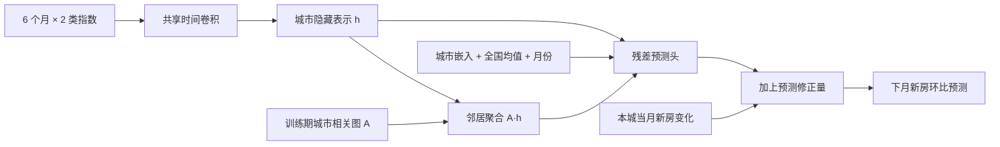
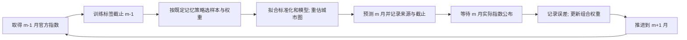

# 算法与实验说明

前 8 节记录原冻结实验与第一轮图模型研究；第 9 节是在发现市场阶段变化后加入的**自适应扩展**，包含已完成的滚动验证、逐月重训、降权、动态城市图和在线专家组合。扩展的实际开发时间为 2026 年 10 月，数据的信息截点仍为 2026-02-28。

## 1. 任务定义与信息边界

给定城市 `c` 截至月份 `t` **已经公布**的住宅价格指数，预测该城市 `t+1` 月新建商品住宅销售价格指数的环比变化。国家统计局的环比指数以上月为 100，定义：

\[
x^{new}_{c,t}=I^{new}_{c,t}-100,\qquad
x^{second}_{c,t}=I^{second}_{c,t}-100,\qquad
y_{c,t}=x^{new}_{c,t+1}.
\]

`x` 和 `y` 数值以百分比表示，MAE 与两个预测值之差以**百分点**表示。例如 99.7 对应 -0.3%，真实值 -0.3% 与预测 -0.1% 的绝对误差为 0.2 个百分点。该指标不是房屋单价，也不是某个楼盘的价格。

项目模拟的信息截点为 **2026-02-28**。当时最新可用的是[国家统计局 2026-02-13 发布的 2026 年 1 月月报](https://www.stats.gov.cn/sj/zxfb/202602/t20260213_1962617.html)。最终对 2026 年 2 月的预测只使用截至 1 月的信息；它是前瞻输出，不进入本项目的测试指标。
月报通常在指标所属月结束后才公布，所以这里预测下一月时，目标月可能已经开始；例如 2 月 13 日收到 1 月数据后预测 2 月指数。严格说，这也是**目标月进行中的短期预测**，不应描述为“在目标月开始前预测”。

## 2. 原始数据与质量控制

`source_index.csv` 冻结 2021-05—2026-01 共 57 个国家统计局原始月报网址。网址索引曾参考[公开整理项目](https://github.com/taifuer/house_price_index)，但数据数值由采集程序从国家统计局页面的表 1（新房）和表 2（二手房）重新提取，不读取整理项目的数值。每条记录保存自己的原始月报网址。

采集过程：

1. 检查网址为国家统计局域名、发布日期路径不晚于 2026 年 2 月、目标月份连续无缺口。
2. 逐页读取前两个价格指数表；合并表格左右两半城市列，清除城市名内的空格。
3. 用 `环比指数 − 100` 转为百分比变化；核对新房和二手房的城市集合均为 70 城。
4. 生成按 `城市 × 月份` 排列的面板数据，保存来源网址；核对无重复键、无缺失。

| 字段 | 含义 | 单位 / 示例 |
| --- | --- | --- |
| `period` | 指数所属月，不等于发布日期 | `2026-01` |
| `city` | 70 城中的城市名 | `济南` |
| `new_mom_pct` | 新房环比指数减 100 | `%`，`-0.4` |
| `second_mom_pct` | 二手房环比指数减 100 | `%`，`-0.2` |
| `source_url` | 本条记录的国家统计局原始页面 | 可点击网址 |

最后数据 **3,990 行 = 70 城 × 57 月**，5 个原始字段合计缺失值为 **0**。新房环比值范围 -2.1% 至 1.9%，二手房为 -2.2% 至 2.0%。这些范围用于质量检查，不作异常值删除。国家统计局月报的[附注](https://www.stats.gov.cn/sj/zxfb/202602/t20260213_1962617.html)说明新房基础数据采用当地房地产管理部门网签数据；本项目只使用其公开的汇总指数。
项目在 2026 年 9 月重新读取了原本在 2026 年 2 月底前发布的官方页面，并以当时的发布日期界定信息集。[data_manifest.json](data_manifest.json)记录重建日期与当前文件的 SHA-256。没有逐页的当时快照，不能证明官方页面在首次发布后绝无修订；申请材料也应填写项目的**真实开发时间**，不能把信息截点写成开发完成时间。

## 3. 特征工程

每行训练样本以城市 `c` 和**输入月** `t` 为键，标签是 `t+1` 月新房变化。构建特征时先在每个城市内部按月份排序，再做位移和滚动计算。

| 特征组 | 具体字段 | 建模意图 |
| --- | --- | --- |
| 当期城市 | `new_mom_pct`、`second_mom_pct` | 最新本地变化 |
| 城市历史 | 新房与二手房各自的 `lag 1/2/3/6`，以及最近 `3/6` 月均值 | 动量、短期趋势 |
| 同期全国 | 70 城新房和二手房当月均值、新房上涨城市比例 | 全国共同变化 |
| 固定信息 | 城市独热编码、月份正弦与余弦 | 城市差异、周期特征 |

其中 `lag 1` 指输入月 `t-1`，`3 月均值` 包含 `t-2,t-1,t`，全部不晚于 `t`。全国当期变量也仅由 `t` 月已公布的 70 城指数计算。最初 6 个月不足以构建最长滞后，故第一批标签是 **2021 年 12 月**。标签和特征来源分别保存在回测表的 `target_source_url` 与 `feature_source_url`，方便逐条核对。

## 4. 时间验证与模型

```mermaid
flowchart LR
    A[57 期国家统计局月报] --> B[城市月份面板与来源核验]
    B --> C[只用截至 t 月的信息构造特征]
    C --> D[目标: t+1 月新房环比]
    D --> E[训练: 目标月至 2023-12]
    E --> F[验证: 2024-01 至 2024-12]
    F --> G[按验证 MAE 选择 Ridge]
    G --> H[训练至 2024-12 后冻结模型]
    H --> I[独立测试: 2025-01 至 2026-01]
    I --> J[用截至 2026-01 的标签重训]
    J --> K[预测 2026-02]
```

| 阶段 | 目标月份 | 样本数 | 作用 |
| --- | --- | ---: | --- |
| 初始训练 | 2021-12—2023-12 | 1,750 | 拟合候选模型 |
| 验证 | 2024-01—2024-12 | 840 | 只在此阶段选择模型类别 |
| 重训 | 2021-12—2024-12 | 2,590 | 为独立测试拟合固定模型 |
| 独立测试 | 2025-01—2026-01 | 910 | 只报告泛化误差及事后诊断 |

全部 70 城的同一目标月只进入一个阶段，避免模型借同月其他城市的真实目标值窥见目标月份。测试期不是逐月更新模型的滚动回测：训练截止 2024-12 后参数冻结，逐个预测 13 个测试月份；每个月的输入特征可以使用那个月预测时已经公布的前月指数。最后生成 2026-02 预测时才用截至 2026-01 已知的标签重新拟合。

对照组包括：预测 0 变化、直接沿用输入月新房变化、每城在**训练部分**的历史标签均值。候选模型：

- **Ridge 回归**：数值特征先标准化，城市独热编码；最小化平方误差与 `α=25` 的 L2 惩罚。它对相关的滞后和滚动特征施加收缩，参数数量受控，便于解释。
- **直方图梯度提升树**：`120` 轮、最多 `15` 个叶节点、学习率 `0.05`、叶节点至少 `30` 样本、L2 惩罚 `0.5`。它提供非线性对照。

参数在本次实验中固定，没有声称完成大规模超参数搜索。每个模型的标准化和编码都在训练流水线内拟合，验证和测试数据只接受训练集生成的变换。每城只有 57 个时间点，而且 70 城同期结果相关；堆叠成 3,990 行不等于有 3,990 个独立时间序列。因此这里优先比较简单可审计的模型，没有为了使用深度学习而强行训练 LSTM。

## 5. 指标与模型选择

主指标为平均绝对误差 `MAE = mean(|预测 − 真实|)`；同时保存中位绝对误差、平均偏差和方向判断。所有 MAE 单位为百分点。选择规则固定为**2024 年验证期 MAE 更低的候选模型**。

| 方法 | 2024 验证 MAE | 2025-01—2026-01 测试 MAE |
| --- | ---: | ---: |
| 零变化 | 0.5574 | 0.3501 |
| 沿用上月 | 0.3377 | 0.2487 |
| 城市历史均值 | 0.4494 | 0.2558 |
| Ridge | **0.2787** | **0.2234** |
| 梯度提升树 | 0.3065 | 0.2094 |

验证阶段选择 **Ridge**。测试期它比沿用上月的基线低 `0.2487 − 0.2234 = 0.0253` 个百分点，相对下降约 **10.2%**。梯度提升树在测试期更好，但不能因为测试结果而修改选模规则。完整的逐城市、逐月份预测保存在 `results/backtest_2025_to_2026_01.csv`。

## 6. 误差与模型行为诊断

**月份依赖。** 2025 年 6、7、8 月，Ridge 的月均 MAE 分别为 **0.2949、0.2651、0.3051**，均高于沿用上月基线的 **0.2386、0.2414、0.2457**。这三个月 Ridge 预测均值为约 **-0.539%**，实际均值约 **-0.291%**，表明那段时期预测偏向过度下跌。最差月份是 2025 年 8 月；错误最大的若干城市月份及其真实来源网址保存在 `results/largest_errors.csv`。

**涨跌不平衡。** 910 个测试样本中，实际下跌 **705**、持平 **45**、上涨 **160**。Ridge 对下跌样本的 MAE 为 **0.1860**，低于基线的 **0.2379**；对上涨样本的 MAE 为 **0.3727**，高于基线的 **0.2888**。160 个真实上涨样本中，Ridge 仅将 44 个预测为上涨。虽然其直接方向准确率为 80.44%，在排除持平样本后，涨与跌两类的**平衡准确率**为 **0.6254**，低于基线的 **0.7239**。因此不能用总体方向准确率宣称模型擅长识别转涨。

**误差改善的不确定性。** 按目标月份把 70 城成组重采样 20,000 次，Ridge 相对基线的 MAE 收益描述性 95% 区间为 **[0.0009, 0.0464]** 个百分点；用连续 3 个月区块重采样，区间为 **[-0.0068, 0.0495]**，跨过 0。只有 13 个测试月份，区间非常依赖重采样假设；不能据此保证未来胜出。

**统计口径。** [2026 年 1 月月报附注](https://www.stats.gov.cn/sj/zxfb/202602/t20260213_1962617.html)注明当月起采用 2025 年作为新一轮对比基期、调整分类权数。仅使用 2025 年 12 个测试月份时，Ridge MAE **0.2282**，沿用上月 **0.2510**；1 月单独分别为 **0.1664**、**0.2214**。主结果不完全由这次口径转换的单月驱动。官方附注给出的平均影响值针对**同比指数**，不能直接当成环比预测误差上界。

**特征组依赖。** 用 2024 年验证集对已训练 Ridge 做 30 次组置换，分别打乱一组字段，观察 MAE 增量。日历组 **+0.0196**、当期新房 **+0.0194**、二手房组 **+0.0171** 个百分点最高。此分析只表示模型在验证期对这些信息的依赖，相关特征会分摊重要性，且不表示因果影响。另做的**事后探索性**消融显示，去掉二手房变量后测试 MAE 为 **0.2170**，略好于完整 Ridge 的 **0.2234**；这提示二手房特征跨时期的价值不稳定，但不能用测试期消融重新选模型。

## 7. 实习与申请展示范围

截至 2026-02-28，使用全部已知标签重训后，山东四城 2026-02 的预测环比变化约为：济南 **-0.215%**、青岛 **-0.362%**、烟台 **-0.334%**、济宁 **-0.450%**。`results/forecast_2026_02.csv` 保存 70 城结果。表中 `historical_80pct_abs_error_pp` 是过去测试绝对误差的第 80 百分位，**不是**有覆盖率保证的预测区间。

项目对房地产开发商的价值是城市市场监测的早期线索，不能直接给楼盘定价或预测新房销量。申请材料中可以重点讲述四项技术决策：如何定义时间上可行的预测任务；如何从官方页面构造可溯源面板；为什么用验证集选择模型且保留独立测试；如何从涨跌不平衡、连续月份失效和基期变化中识别模型边界。

## 8. 进阶实验：城市关联与小型图时序网络

为了研究城市间价格变化是否能帮助预测，我参考了[NeurIPS 2020 的 AGCRN 论文](https://proceedings.neurips.cc/paper/2020/hash/ce1aad92b939420fc17005e5461e6f48-Abstract.html)与[作者代码](https://github.com/LeiBAI/AGCRN)，以及[KDD 2020 的 MTGNN 论文](https://arxiv.org/abs/2005.11650)与[作者代码](https://github.com/nnzhan/MTGNN)。AGCRN 启发了**城市专属表示**的设计；MTGNN 启发了**时间编码与跨节点信息聚合**。本项目的实现是适应 57 期月度数据的小模型，**不是对两篇论文的复现**，也没有直接复制其网络或声称达到论文结果。[AAAI 2023 的线性时序预测研究](https://ojs.aaai.org/index.php/AAAI/article/view/26317)也提醒我们必须保留强的简单模型对照。由于每城只有 57 个月，没有直接套用需要较长历史和大量样本的 Transformer。

新模型在[train_graph_temporal.py](train_graph_temporal.py)中实现。每个样本取该城最近 **6 个月 × 新房/二手房 2 个通道**。两层一维卷积编码时间窗口；每城一个 4 维可学习嵌入；从图中聚合邻居隐藏表示，再与全国当月均值、月份周期特征合并。输出采取残差形式：

\[
\hat y_{c,t}=x^{new}_{c,t}+\operatorname{MLP}\left(h_{c,t},\sum_j A_{cj}h_{j,t},e_c,g_t,m_t\right).
\]

这里 `h` 是时间卷积表示，`e` 是城市嵌入，`g` 是全国当月新房与二手房均值，`m` 是日历特征。网络仅 **1,625 个可训练参数**；使用 Huber 损失（`β=0.25`）、AdamW、梯度裁剪、验证期早停，3 个随机种子预测取均值。小参数量和强正则是对短面板数据的约束，不保证神经网络一定优于 Ridge。

比较三个结构，其他网络、时间划分和训练流程保持一致：

1. **无图**：邻居聚合为 0，只保留城市时间卷积与嵌入。
2. **原始相关图**：只用训练期各城市新房变化的正相关系数，每城保留相关最高的 5 个其他城市，行归一化。
3. **去全国趋势图**：先从每城当月变化中减去 70 城当月平均，再按相同方法建图，尝试捕获城市的相对共变。

在验证 2024 年时，图只能由截至 **2023-12** 的数据估计；重新训练并回看 2025 年时，图最多使用截至 **2024-12** 的数据。因而没有用未来月份计算邻接矩阵。前瞻预测 2026-02 时才允许用截至 2026-01 的数据重估图。`results/*graph_neighbors*.csv` 保留了城市邻居和权重。

| 结构 | 2024 验证 MAE | 2025-01—2026-01 回顾性 MAE |
| --- | ---: | ---: |
| 无图时间卷积 | 0.294818 | 0.2138 |
| 原始相关图 + 时间卷积 | 0.295608 | 0.2221 |
| 去全国趋势图 + 时间卷积 | **0.294761** | 0.2190 |
| 原主模型 Ridge（供对照） | **0.2787** | 0.2234 |

去全国趋势图在新模型内部的验证 MAE 最低，但相对无图模型只改善 **0.000057 个百分点**，无法视为稳定的图结构收益；三种神经结构在验证期都没有超过 Ridge。2025 年回顾性结果中，无图反而最好。去全国趋势图从训练截至 2023 年更新到截至 2024 年时，每城前 5 名邻居集合的平均 Jaccard 相似度为 **0.431**，提示短样本估计的关系有一定变化，不能把相关边解释为真实经济联系。

**实验纪律：** 进阶模型是在原项目已经检查过 2025—2026 年测试期之后加入的，因此表中的进阶模型该期分数是**探索性历史比较**，不能称为一轮新的独立盲测。验证期仅在进阶结构内部选择了“去全国趋势图”，也不足以推翻原先由验证期选出的 Ridge 主模型。申请展示中更有价值的结论是：从顶会方法提出城市图假设，实现轻量模型和严格的无图/原图/去趋势图消融，并让实证结果否定“图一定有用”的预设。

## 9. 市场变化下的自适应预测

### 9.1 问题修正与阶段差异

原来的时间切分能防止未来信息进入训练，但**不能保证训练期与预测期的规律稳定**。这里要区分两个问题：数据的分布变化可以直接观察；条件关系 `P(y|X)` 是否改变，需要更多证据，不能单凭均值变化就证明概念漂移。项目把市场非平稳性当作待检验的建模风险。

“2023 年之前完全没有下跌”也不符合这份数据。[国家统计局对 2022 年 12 月的解读](https://www.stats.gov.cn/sj/sjjd/202302/t20230202_1896733.html)已报告新房环比下跌城市 55 个、二手房 63 个。以下是本项目面板自行计算的描述性统计：

| 年份 | 已覆盖月份 | 新房月环比均值 | 二手房月环比均值 | 新房下跌城市月份比例 |
| --- | ---: | ---: | ---: | ---: |
| 2021 | 5—12 月，8 个月 | +0.054% | -0.073% | 44.6% |
| 2022 | 12 个月 | -0.196% | -0.325% | 65.8% |
| 2023 | 12 个月 | -0.076% | -0.346% | 53.8% |
| 2024 | 12 个月 | -0.493% | -0.704% | 86.0% |
| 2025 | 12 个月 | -0.260% | -0.520% | 76.5% |
| 2026 | 仅 1 月 | -0.366% | -0.539% | 88.6% |

这些是 70 城等权平均的**月环比**及城市月份占比，不是官方全国房价指数，也不是年度累计涨跌幅。2021 与 2026 覆盖不完整，不作全年对比。由此可见，任务涉及下跌幅度扩大、缓和和城市差异变化，不能用一个固定“下跌市场”标签概括所有月份。逐月统计保存在 `results/adaptive/monthly_market_regimes.csv`，年度汇总在 `yearly_market_regimes.csv`。

原模型的 2025 年预测其实已经用截至 **2024-12** 的标签重训，因此并非始终只学习 2023 年以前的数据。其实际弱点是：随后 13 个月参数不再更新，且所有历史样本同权。

### 9.2 将冻结评估改成逐月滚动

采用滚动起点验证（rolling-origin / walk-forward）。目标月记为 `m`：模型用已发布的 `m-1` 指数作输入，训练标签最多也是 `m-1`。预测产生后，等待 `m` 指数公布，才允许把该标签加入下一次训练。

| 预测目标月 | 拟合最多使用的标签月 | 该次输入月 | 下一次允许新增的标签 |
| --- | --- | --- | --- |
| 2025-01 | 2024-12 | 2024-12 | 2025-01，待公布后 |
| 2025-02 | 2025-01 | 2025-01 | 2025-02，待公布后 |
| 2025-03 | 2025-02 | 2025-02 | 2025-03，待公布后 |
| 2026-02 | 2026-01 | 2026-01 | 截点时没有 2026-02 实际值 |

同月的 70 城整体向前推进；全国特征也只能读取已公布的输入月。目标月进行中的预测语义沿用第 1 节。验证期实际值在公布后进入后续验证起点的训练，是该滚动协议允许的在线更新；**绝不能用于预测它自身的月份**。评估期也采用相同规则，选择好的窗口、半衰期、网络训练预算等策略保持不变。

2024 年的 12 个滚动起点用于选择策略；2025-01—2026-01 的 13 个起点作回顾性比较。不会把月份随机打乱，也不会仅因出现下跌而把之前所有数据删除。现在只有一个 2026 年实际月份，不能将它独立当成足以证明泛化的整年测试集。

### 9.3 三种历史记忆策略

对 Ridge、无图时序网络、去全国趋势图网络分别比较：

1. **全部历史，逐月重训**：保留从 2021-12 起所有已知标签，新发布月份持续加入。
2. **最近 24 个月，逐月重训**：每个起点只取最近 24 个目标月份。早期窗口仍会读取构造这些样本所需的更早输入序列；这是合法的过去信息。
3. **全部历史，按时间降权**：半衰期固定为 12 个月。对年龄为 `a` 个月的训练标签，先取 `u(a)=2^{-a/12}`，再除以训练月份平均权重；12 个月前的样本相对最新样本权重是 1/2，24 个月前为 1/4。同一标签月的 70 城权重相同。

Ridge 的数值标准化均值、方差和平方损失都使用同一训练权重；平均权重归一为 1，使 `α=25` 的正则项不会仅因整体权重尺度改变而变化。城市编码只在训练城市上拟合。

网络复用第 8 节的 1,625 参数结构，3 个种子为 `13/31/47`；每月从头训练 **60 轮**，AdamW 学习率 0.006、权重衰减 0.02、Huber `β=0.25`、梯度裁剪 1。训练损失先在 70 城求均值，再对月份加权。固定训练预算避免使用当月或未来真实值早停；60 轮是根据此前验证中几十轮的训练规模确定的小预算，并非声称完成了新的大范围搜索。

网络输入标准化只依赖所选训练样本，使用同样的月份权重。去趋势图用同样的训练标签月份计算新房变化，在每月减去 70 城均值后计算加权协方差和正相关，每城保留 5 个其他城市，归一化邻接行。**图每个起点重建**，不能从完整 57 个月先算好关系再切分数据。

| 2024 滚动验证 MAE（百分点） | 全部历史 | 最近 24 月 | 12 月半衰期 |
| --- | ---: | ---: | ---: |
| Ridge | **0.2781** | 0.2816 | 0.2798 |
| 无图时序网络 | **0.2957** | 0.2988 | 0.2960 |
| 去趋势图网络 | **0.2963** | 0.3088 | 0.3041 |

三个模型族均在验证期选择“全部历史、逐月重训”。这表明**及时更新参数有必要检验，但直接丢弃旧数据不是当然更好**。短窗口减少时间样本，可能增加估计方差；本结果也不证明其他窗口或更长数据永远没有价值。只检验了这三个事先列明的策略。

### 9.4 过去误差驱动的在线专家组合

参考 [OneNet，NeurIPS 2023](https://proceedings.neurips.cc/paper_files/paper/2023/hash/dd6a47bc0aad6f34aa5e77706d90cdc4-Abstract-Conference.html)中随数据到达更新模型组合的思路，独立实现一个适合短月度面板的专家组合。它**不是 OneNet 复现，也没有实现其强化学习模块**。

四个专家分别为逐月 Ridge、逐月无图网络、逐月去趋势图网络、沿用上月变化。所有城市共享四个权重，避免在仅有几十个月的情况下为每城再估计一套门控网络。专家 `k` 的已公布月份误差状态为：

\[
\ell_{k,m}=\frac{1}{70}\sum_c |y_{c,m}-\hat y^{(k)}_{c,m}|,
\qquad s_{k,m}=\rho s_{k,m-1}+(1-\rho)\ell_{k,m}.
\]

预测 `m` 月时只读取 **`s_{k,m-1}`**：

\[
w_{k,m}=\frac{\exp(-s_{k,m-1}/\tau)}{\sum_j\exp(-s_{j,m-1}/\tau)},
\qquad\hat y_{c,m}=\sum_k w_{k,m}\hat y^{(k)}_{c,m}.
\]

先预测，后等官方标签公布并更新 `s`。指数记忆系数 `ρ∈{0.5,0.8,0.95}`，温度 `τ∈{0.02,0.05,0.1}` 个百分点，共 9 个候选，由 2024 滚动 MAE 选择；2024 开始时误差状态全为 0、权重均匀。2025 开始时继承 2024 末已知的状态，而非使用 2025 的未来误差。最优组合规则为 `ρ=0.5, τ=0.02`，验证 MAE **0.2832**；固定四专家均匀组合为 **0.2893**。但二者都没有超过逐月 Ridge 的 **0.2781**，所以组合仅作研究候选。

### 9.5 回顾性结果与剩余问题

| 方法 | 2025-01—2026-01 MAE | 2025-06—08 MAE | 上涨样本 MAE（全回测期） |
| --- | ---: | ---: | ---: |
| 沿用上月 | 0.2487 | 0.2419 | **0.2888** |
| 原冻结 Ridge | 0.2234 | 0.2884 | 0.3727 |
| 逐月 Ridge | 0.2135 | 0.2503 | 0.3491 |
| 逐月无图时序网络 | 0.2128 | **0.2076** | 0.3276 |
| 逐月去趋势图网络 | 0.2141 | 0.2132 | 0.3313 |
| 在线组合 | **0.2072** | 0.2133 | 0.3232 |
| 固定均匀组合 | 0.2103 | — | 0.3105 |

单位为百分点。逐月 Ridge 比原冻结 Ridge 的总体 MAE 低约 **4.5%**，比沿用上月低约 **14.2%**；平均偏差由 **-0.0735** 缩小到 **-0.0424** 个百分点。原夏季 MAE 0.2884 降到 0.2503，但仍略差于简单基线 0.2419。无图网络在该段误差更小，动态城市图仍未显示相对于无图的稳定收益。

另有同预算的冻结网络对照：无图网络冻结 MAE **0.2156**、逐月 **0.2128**；图网络冻结 **0.2167**、逐月 **0.2141**。这一对照才是在本轮固定训练预算下比较“是否更新”。第 8 节网络使用验证早停、图历史范围也不同，不能把本轮分数差异全部归因于逐月更新。

逐月 Ridge 在 **12/13** 个回测月份胜过沿用上月，无图、图网络及在线组合为 **13/13**。按连续 3 个月圆形区块重采样 20,000 次，逐月 Ridge 的基线 MAE 收益 95% 描述性区间为 **[0.0146, 0.0499]** 个百分点；在线组合为 **[0.0343, 0.0467]**。区间仅描述这 13 个月，在已观察过结果后追加方法，也不能作为未来持续胜出的证明。

所有新增模型对真正上涨样本的 MAE 仍高于简单基线，因此**市场变化问题得到部分缓解，拐点识别并未解决**。指标同时保存上涨/下跌误差、平均偏差和两种平衡方向准确率：二元口径将预测 0 归入非上涨；三类符号口径将预测 0 对真实涨/跌都计错，两者不能混用。

### 9.6 选模纪律、审计与输出

最终采用的更新规则仍是**全部历史、逐月重训的 Ridge**，因为它在 2024 滚动验证中得分最低。神经网络与在线组合保留为可解释的技术研究和对照，不能根据它们更低的 2025 回顾性 MAE 将其追认为验证优胜者。

本扩展是在已经看过原 2025—2026 年结果后提出，**所有新增该期指标均为探索性回顾性评估**。在各起点严格不读未来信息，并不能消除研究者已经看过整个评估期的选择偏差。数据截点限制下，尚无未接触的后续月份可供新盲测；不能用 2026 年 3 月后发布的数据补测并声称仍符合实习前的信息边界。

实现与可复核证据：

- `train_adaptive_backtest.py`：9 类“模型族 × 记忆策略”的 2024 逐月预测，再按验证规则选择策略，进行月度回测与冻结对照。策略先写入 `selection_2024.json`，后执行回测。
- `train_online_ensemble.py`：只读取已保存的合法逐月预测，先按 2024 选择组合规则，再逐月先预测后更新误差状态。
- `results/adaptive/training_cutoff_audit.csv`：记录 **153 次拟合**的训练标签起止、目标月份、权重有效月数及图截止。13 个月的预测仍是 **910 条城市月份记录**，不是 910 个独立时间点。
- `verify_adaptive_protocol.py`：将目标及未来标签、未来图数据大幅改动，确认当月 Ridge 和图网络预测完全不变；对组合也验证目标标签只能影响后续月份权重。核验过去截止、24 月窗口、半衰期及冻结 Ridge 对原结果的复现；结果在 `protocol_verification.json`。
- `rolling_backtest_exploratory.csv`、`ensemble_backtest_exploratory.csv`：保存全部逐城预测，不只展示最优月份。模型权重表保存**预测之前**的权重和此前误差状态。
- `forecast_2026_02.csv`：验证支持的更新模型前瞻输出；`ensemble_forecast_2026_02.csv`另存候选组合。两者均只用截至 2026-01 的真实值，没有给 2026-02 打分。Ridge 用全部已知标签，因此这次最终输出与原方案最终重训的 Ridge 基本一致，改变的是之前的月度更新协议。

该扩展把项目的研究主线完善为：**识别市场阶段差异 → 设计合法的在线更新 → 比较历史记忆策略 → 验证动态结构与专家组合 → 审计误差与时间边界**。市场分布诊断和每月更新已经实现，但未声称实现自动漂移告警器或证明预测关系变化的成因。

## 10 完成输入与结构消融

2026年10月4日完成20个单模型和2个组合配置。输入补齐网络采用七个月双通道序列、相同19项特征与城市嵌入，共1697参数。三种子验证MAE 0.2791，五种子复核 0.2803，回顾性MAE 0.2067；主模型仍为逐月Ridge。校正、归一化、双分支和方向任务的结果、时间协议及负结果见[最终实验报告](最终实验报告.md)。保存权重可通过`predict_saved_models.py`无重训复现。最新展示介绍见[项目介绍与面试准备](项目介绍与面试准备.md)。此前章节数值作为早期版本保留，新增结果属于回顾性研究。
